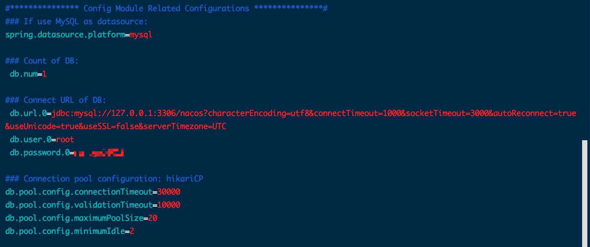

# Spring cloud Nacos安装（Linux安装Nacos2.0）
本文教你如何在Linux系统中安装和部署nacos配置中心。服务（Service）是 Nacos 世界的一等公民。Nacos 支持几乎所有主流类型的服务的发现、配置和管理。使用 Nacos 简化服务发现、配置管理、服务治理及管理的解决方案，让微服务管理、共享、组合更加容易。
## 1、下载Nacos安装包（tar包）
-  [源码下载地址](https://github.com/alibaba/nacos/releases) 
-  [镜像下载地址](http://159.75.113.238/tool/nacos/nacos-server-2.0.0.tar.gz)(源码在github上，有些下载慢的可以选择镜像下载)

## 2、安装配置
- 通过FTP工具将下载好的压缩包传至服务器，或者在服务器上使用命令 
<pre>
# 下载nacos2.0安装包
wget http://159.75.113.238/tool/nacos/nacos-server-2.0.0.tar.gz

# 解压
tar -xvf nacos-server-2.0.0.tar.gz
</pre>
- 创建数据库（[数据库需要mysql5版本，mysql8版本的需要自行修改源代码切换驱动](https://blog.csdn.net/qq_22934887/article/details/102667183))

<pre>
mysql -u root -p 

create database nacos;
</pre>
- 然后退出数据库修改nacos目录下conf/application.properties文件中的数据库地址

    
修改配置文件

  
<pre>
# 进入nacos目录下的bin文件夹，启动命令
# 单机启动（3个或3个以后上的nacos才能构成集群，集群模式需要在conf文件下新建配置cluster.conf文件）
sh startup.sh -m standalone
</pre>
-  可以进入nacos/logs/start.out文件查看启动状态，启动完成后在浏览器输入 http://ip:8848/nacos/index.html 即可查看

# 3、java注册nacos

-  [Spring boot，Spring cloud 测试案例](https://github.com/XiaoTiJun/nacos2.0-example) 

# 4、参考
https://nacos.io/zh-cn/docs/quick-start.html 
https://nacos.io/zh-cn/docs/quick-start-spring-boot.html 
https://nacos.io/zh-cn/docs/quick-start-spring-cloud.html

# 📎
[maven仓库地址](https://mvnrepository.com/)

# END
- 若对你有所帮助，帮忙点个star。❤️❤️❤️
- File bugs, problems requests in [GitHub Issues](https://github.com/XiaoTiJun/ExperienceSharing/issues).