# VPS服务器厂家比较
-  此次比较的服务器厂家为（vultr、AWS、Aliyun）三家，各有利弊，请各位看官自取所需。

### 目录
- [VPS服务器厂家比较](#vps服务器厂家比较)
    - [目录](#目录)
  - [vultr](#vultr)
  - [AWS](#aws)
  - [Aliyun](#aliyun)
  - [Compares](#compares)
- [END](#end)

## vultr

-  vultr [注册地址](https://www.vultr.com)，新用户注册享有不定期的充值活动，楼主新注册时是充10$送100$，不过只享有30天有效期。读者们可以等账户余额用完后使用 [临时邮箱](https://www.linshiyouxiang.net/) 注册一个新账号就可以继续享受活动。将羊毛薅到极致。
    
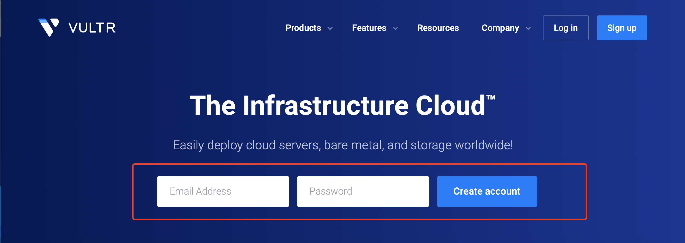

    
注册成功后邮箱将会收到一封邮件

- 注册后登陆然后充值：
    
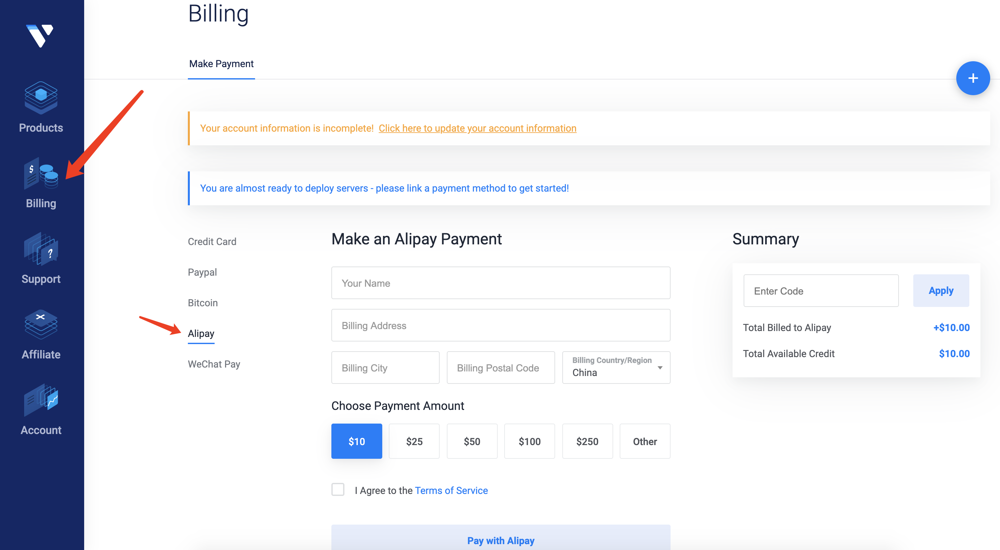

    
充值界面

-  充值完成后选择服务器，各位可以使用 [亚马逊](https://www.cloudping.info/) 或者 [阿里云](https://ping.gaomeluo.com/aliyun/) 的测速网点查看与你延迟最低的服务器区域，选择那个区域的服务器就可以了：
    
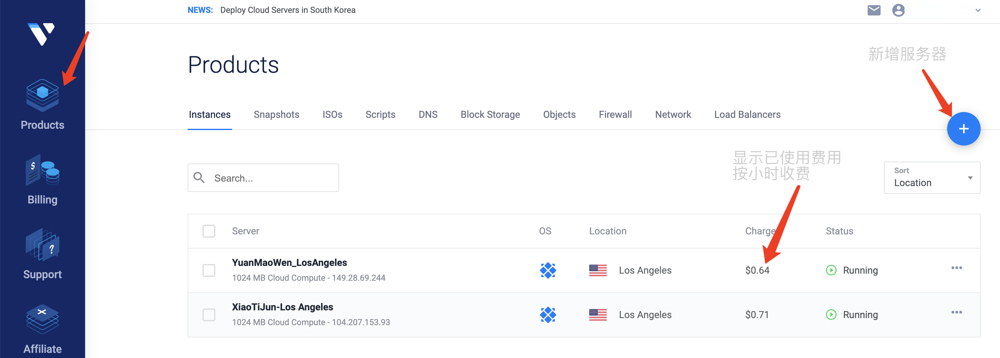

    
    
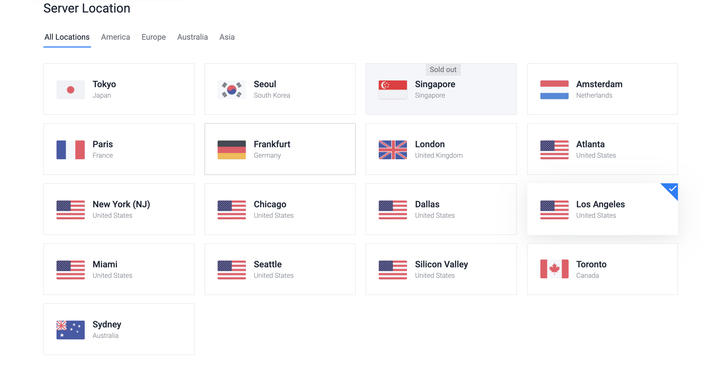

    
选择服务器，这里选的是洛杉矶的，美国西部地区

    
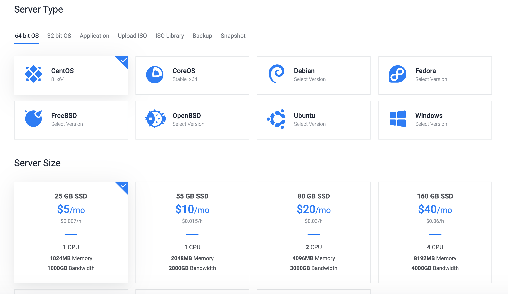

    
选择$5/月就可以了，如果想搭网站或其他的就选择好一点的

    
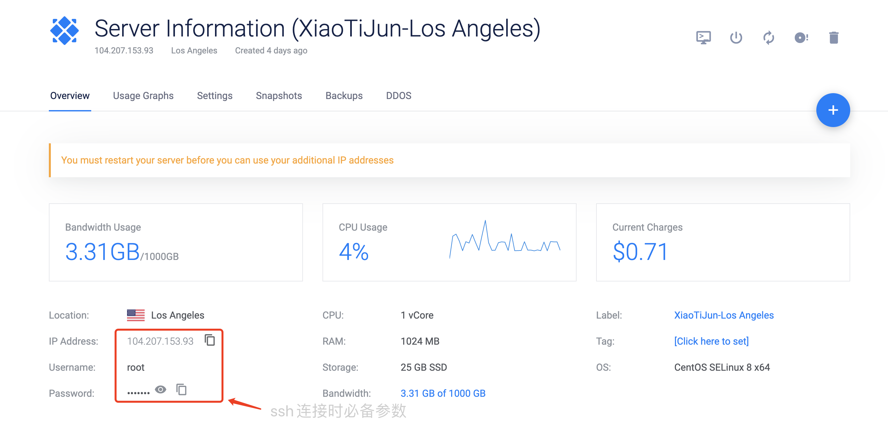

    
购买完成后进入此界面，然后使用SSH连接工具进行连接即可

    
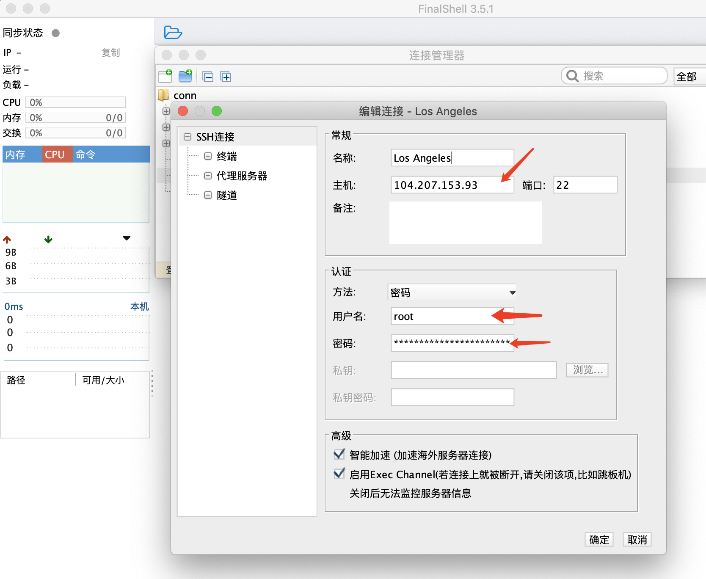

    
博主使用的是FinalShell工具，将参数填入就可以连接

- 连接成功后就可以安装shadowsocks来进行翻墙，安装教程请参照博主的另一篇文章，附有详细说明。[II、安装shadowsocks（python版)](./VPSStructures.md)

## AWS

-  此服务器厂安装教程可查看 [VPS搭建](./VPSStructures.md)

## Aliyun

-  首先 [注册阿里云](https://account.aliyun.com/register/qr_register.htm?spm=5176.8097504.fszjobuve.23.2ec76fb52jOtlQ&oauth_callback=https%3A%2F%2Fwww.aliyun.com%2Fnotfound%2F)，新用户注册活动力度还是很大的，注册完成后登陆阿里云。

- 登陆成功后找到 云服务器ECS 然后点击 立即购买：
    
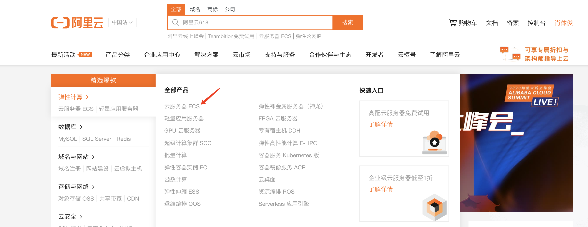

    
博主使用的是FinalShell工具，将参数填入就可以连接

    
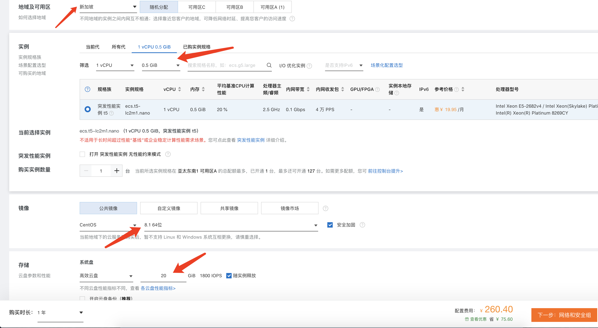

    
地域：新加坡，配置：1核CPU，500M内存，系统：centOS-8，磁盘：20GB

    
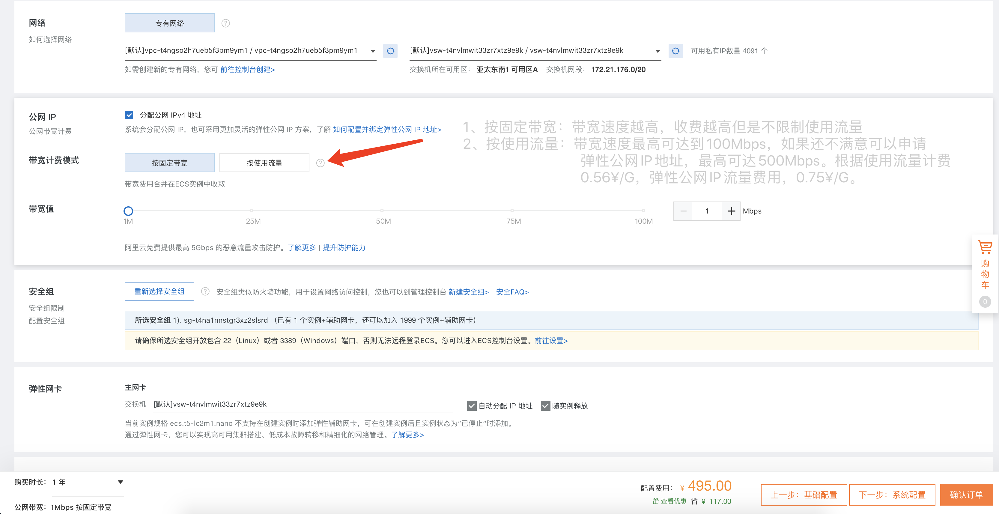

    
这两种选择都各有利弊，各位自行选择即可

    
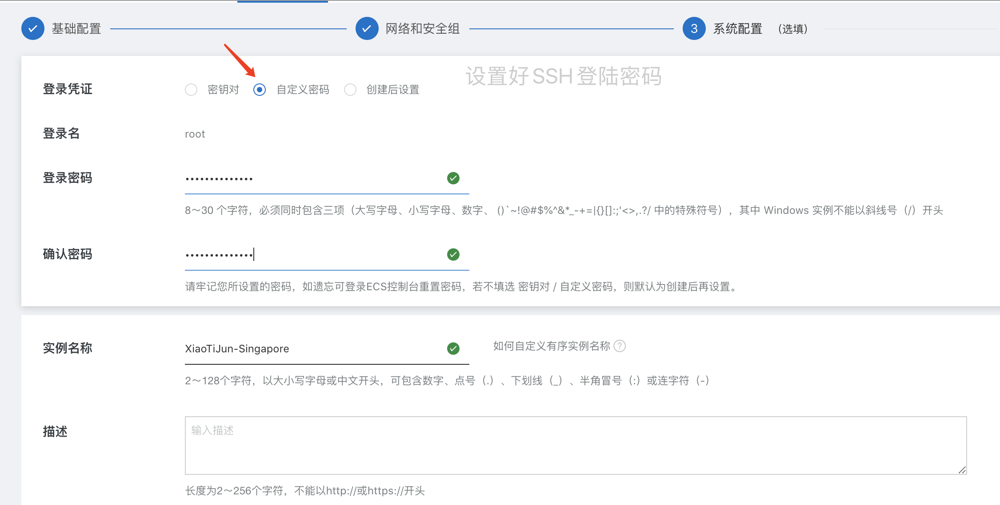

    
设置SSH连接时的账号密码

-  购买成功后进入ECS控制台：
    
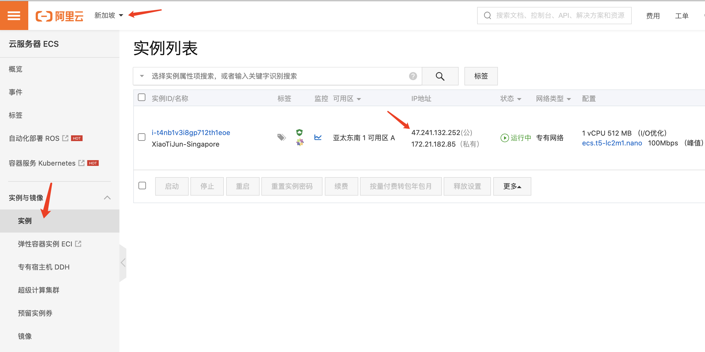

    
选择好服务器区域，随后使用SSH连接工具进行连接

    
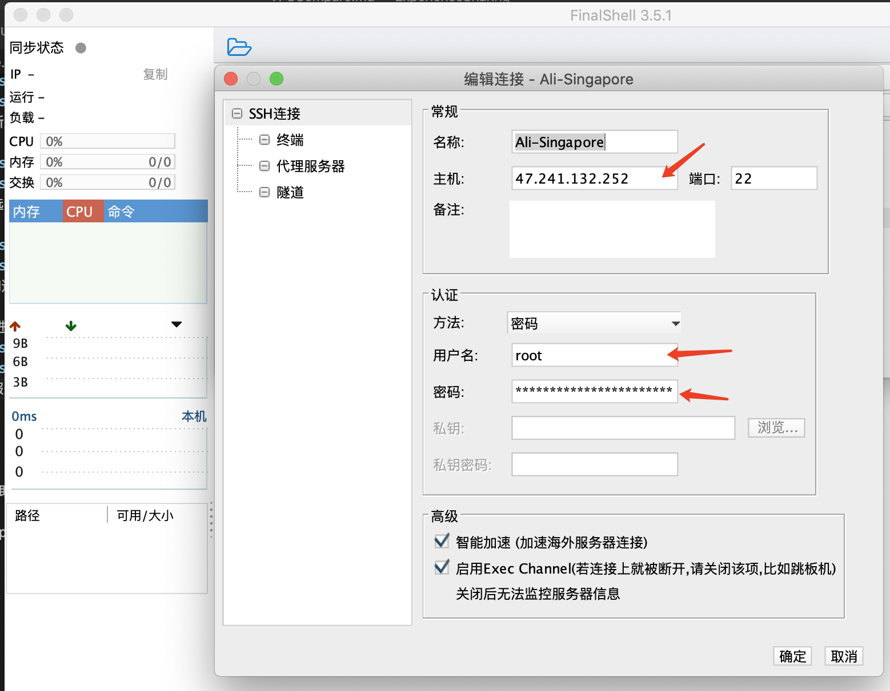

- 连接成功后便可进行 [安装shadowsocks](./VPSStructures.md)

## Compares

| 服务器  | 配置 | 费用 | 服务器地区 | 平均响应时间 | 速度 |
| ------ | ---- | ---- | ---- | ---- | ---- |
| Vultr  | 1CPU 1G内存 1T带宽/月 | $5月 | Los Angeles(洛杉矶，美国西部) | 230ms |    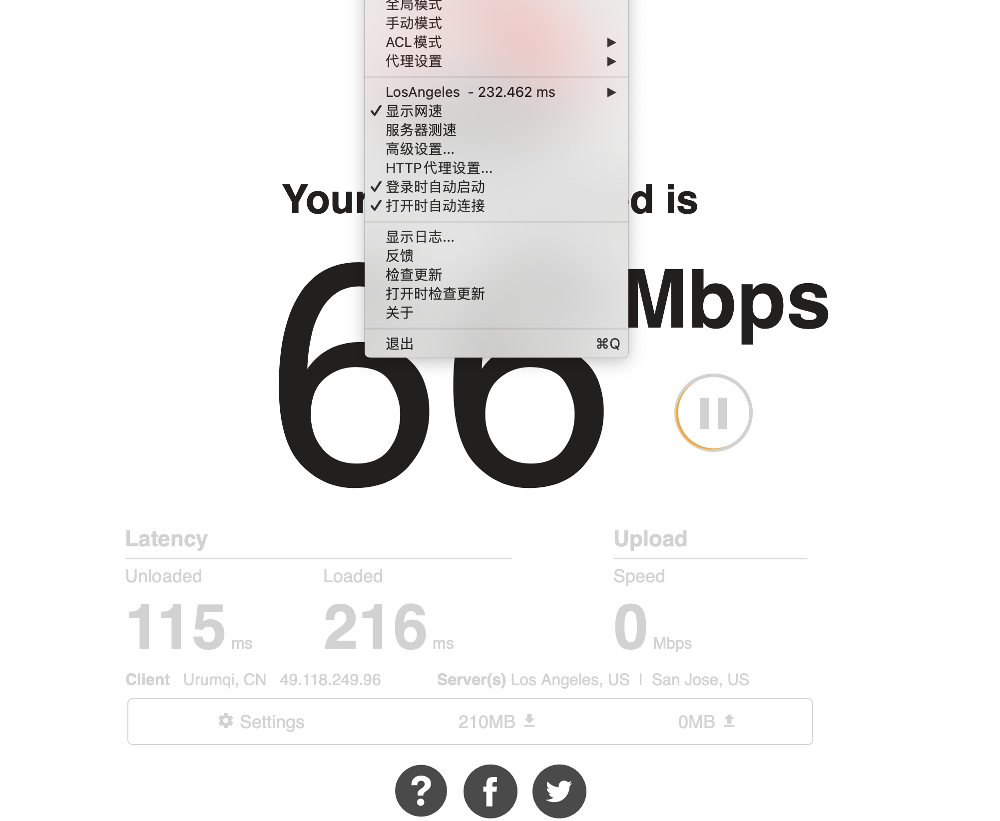
本机测试最快66M，最慢2M，稳定10M左右
    |
| AWS    | 2CPU 1G内存 | 免费 | HongKong(香港，亚太) | 170ms |    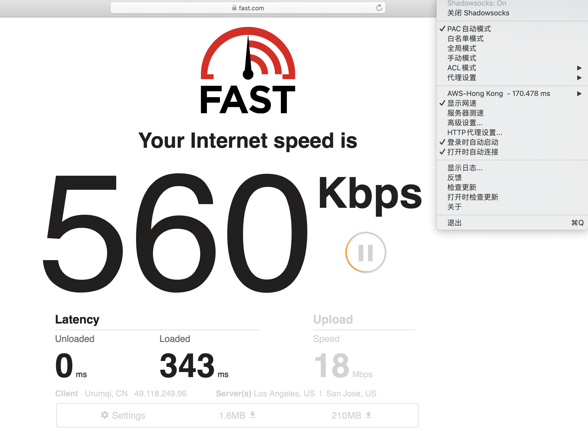
本机测试最快22M，最慢200Kb，稳定500Kb左右
    |
| Aliyun | 1CPU 0.5G内存 | ¥260/年 ¥0.53/G流量 | Singapore(新加坡，亚太) | 135ms |    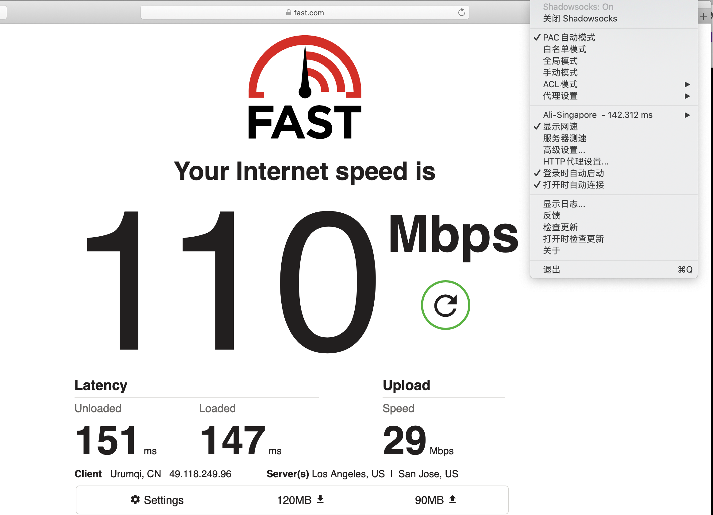
本机测试最快110M，最慢70M，稳定100M左右
  |

# END
- 若对你有所帮助，帮忙点个star。❤️❤️❤️
- File bugs, problems requests in [GitHub Issues](https://github.com/XiaoTiJun/ExperienceSharing/issues).