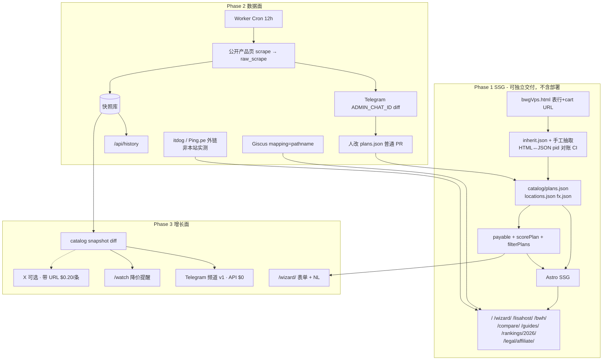
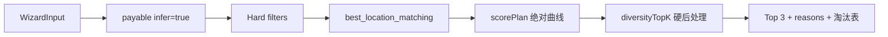
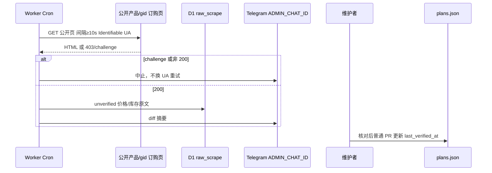

# VPS 选购神器：从静态套餐页到可查询、可推荐的三年期产品设计

| 字段 | 内容 |
| --- | --- |
| 文档标题 | VPS 选购神器（LisaHost + BandwagonHost）产品与技术设计 |
| 作者 | TBD（ExperienceSharing / ScienceNoBorders） |
| 日期 | 2026-08-24 |
| 状态 | **负责人已拍板（2026-08-24）** |
| 北辰目标 | 用户输入「预算 500 元、美国、需要原生 IP、主要建站」→ 从 LisaHost + 搬瓦工目录算出 Top 3 |
| 当前基线 | `/Users/xiaotijun/Documents/ExperienceSharing/VPS/html/bwgVps.html`（**1107** 行，无后端、无 JSON、无筛选） |
| 范围厂商 | Phase 1–3 仅 LisaHost（aff=13150）与 BandwagonHost（aff=76211） |
| 部署 | **本计划不包含域名购买与网站部署**（不含 DNS、Pages 选型、备案） |
| 生产金样 | `lisahost-66` 55.3 / `lisahost-52` 50.2 / `lisahost-168` 45.5（向导「原生 IP」**不含**搬瓦工） |
| `flags.bwh_counts_as_native` | **false（锁定）** |

---

## Overview

今天的产品是一份双品牌「套餐控制台」：`bwgVps.html` 把丽萨主机 18 款年付特价 + 美/港/新/台/日/英系列，以及搬瓦工 KVM / CN2 GIA‑E / SLA / 港日新迪拜方案，全部硬编码进一张暗色运维风 HTML。它适合已经知道自己要哪条线路的人扫表下单，但不会帮「预算 500、美国、原生 IP、建站」这种自然语言需求做决策。页面 StatusBar 自称「实时库存监测中」，实际既无库存接口，也无真实 Ping。`#speed` 是 **7 行文字名次**（香港/东京 GIA → … → 新泽西/纽约/阿姆斯特丹），**没有** `.signal` 条；signal bars 出现在各系列标题右侧（如 KVM `t5`「基础线路」），同属定性经验，不是实测。

本设计把站点升级为 **VPS 选购神器**：以一份结构化套餐目录（plan catalog）为唯一数据源，Phase 1 用静态站点生成（SSG）拆出可筛选首页、2026 推荐榜、厂商独立页、对比页与线路科普；Phase 2 引入价格/库存时间戳、历史价、第三方测速外链与评论；Phase 3 补齐 SEO 元数据、Telegram 变价频道（X 按次付费可选）、降价提醒，以及北辰向导的自然语言入口。Phase 1 就必须把目录、`payable()` 与确定性 `scorePlan()` 落地，这样 Phase 3 的向导只是同一套硬过滤 + 加权排序的 UI，而不是另起一套产品。

**本计划不包含域名购买与网站部署。** 架构是 Astro SSG + JSON catalog（Phase 2 起需要能跑 cron 的小后端），在哪家 PaaS / 哪台机器上发布、DNS、备案均留到部署阶段，不阻塞本设计。

---

## Background & Motivation

### 当前状态（已核对本文件，不是泛泛的 VPS 站）

| 维度 | 事实 |
| --- | --- |
| 代码形态 | 单文件 `bwgVps.html`（1107 行）+ `favor.ico` / `github.svg` / `telegram.svg` / `x.svg` / 本地化 `googleapiscss2.css` |
| JS | 仅 `copyDiscountCode()`，优惠码 `TS-CBP205DQJE` |
| 视觉 | `--void #0A0D13` 运维控制台；JetBrains Mono + Noto Sans SC；Lisa 粉 `--signal:#FF6FA8`（`.lisa-scope`），BWH 青 `--signal:#4DD8C4`；卡片档位 `tier-entry` / `tier-rec` / `tier-top`；signal bars `t1`–`t5` 在**系列头** |
| 内联 CSS | 约第 8–260 行（~253 行） |
| Lisa 区块 | `#lisa-hero` `#lisa-quick` `#lisa-annual` `#lisa-us9929` `#lisa-us4837` `#lisa-cera` `#lisa-hk` `#lisa-sg` `#lisa-tw` `#lisa-jp` `#lisa-uk` `#lisa-note` |
| BWH 区块 | `.hero` `#quick` `#speed` `#kvm` `#gia-e` `#sla` `#sg` `#osaka` `#tokyo` `#hk` `#dubai` |
| 目录规模 | LisaHost **65** 个不重复 `pid`（67 条 cart 锚点，精选卡重复 59、91）；BWH **46** 个不重复 `pid`（49 条锚点，精选卡重复 44、87、95）；合计 **111 SKU** |
| 价格币种 | Lisa 全 CNY（年/月/季/1 天）；BWH 全 USD（年/半年/季/月），同 SKU 常双周期 |
| 已有可结构化字段 | CPU/RAM/Disk、流量、带宽、机房、线路/ASN、IP 类型（年付表才有原生/非原生/双 ISP 住宅/静态家宽）、大陆优化 vs 建议中转、限售/不限流量/最推荐、affiliate cart URL |
| 数据质量坑 | 精选卡文案 ≠ 表行。BWH 精选卡 pid=44 写「DC3 CN2 / DC8 ZNET」；`#kvm` 表行是 DC2/DC4/DC8/FMT/NJ/NY/CA/NL，**没有 DC3**。DC3 只出现在精选卡、`#speed` 名次、GIA‑E `.series-desc`。抽取以**表行 + cart URL** 为准 |
| 核验日期 | 文案写死 `2026-08` |
| 法律 | footer 已声明非官方、aff 不加价、合法使用；目前只点名「并非搬瓦工官方」，Lisa 占一半 SKU 却未并列；Lisa 段另有折扣码说明 |
| 不要并入的文档 | `VPS/VPSStructures.md`（SS 搭建）、`VPS/VPSCompare.md`（Vultr/AWS/Aliyun 旧对比） |

### 痛点

1. **不可查询**：用户只能滚屏。年付特价 18 行与各系列月付表有近似 SKU（例如年付 `pid=61` vs 9929 表「特价年付」`pid=168`），人眼对账成本高。
2. **不可比较**：Lisa 与 BWH 在同一长页但币种、计费周期、IP 语义、机房粒度都不同，没有统一「本单应付人民币」轴。
3. **决策入口缺失**：精选卡是编辑拍脑袋的三张卡，不是预算/地区/IP/场景的函数；且卡上机房文案会污染 SKU。
4. **数据会腐烂**：价格在 HTML 里，改一行要碰布局；「实时库存」是装饰；经验条会被误认为实测。
5. **SEO 与分发为零**：一个 `#anchor` 页抢不了「CN2 GIA 是什么」「LisaHost 和搬瓦工哪个好」这类查询。

同类站点的竞争力来自 **筛选 + 榜单 + 线路科普 + 更新时间**。选购向导是这两家目录上还没人做好的差异化。

---

## Goals & Non-Goals

### Goals

- **G1.** 把 `bwgVps.html` 全部套餐抽出为版本化 catalog，后续页面、筛选、榜单、向导、社媒 diff 只读这份数据。
- **G2.** Phase 1 产品可独立交付：首页三档 IP 筛选、2026 推荐榜、`/lisahost/`、`/bwh/`、对比页、四篇线路科普、`/wizard/` 表单、`/legal/affiliate/`；视觉语言继承现站。构建产物含 `robots.txt` + `sitemap.xml` + canonical（作为站点 IA，**不**等于上线到某域名）。IndexNow / Search Console 注册留 Phase 3 且仍不绑定具体主机。
- **G3.** 目录字段必须足够支撑北辰推荐（预算、地区、线路、三档 IP、场景、厂商、周期），Phase 3 不再改 schema 主干。
- **G4.** 所有对外价格/库存带 `last_verified_at`；未知库存显示「未核验」，禁止编造 live stock。
- **G5.** 保留 aff 经济：Lisa `aff=13150` + 码 `TS-CBP205DQJE`，BWH `aff=76211`；每页披露非官方（两家都点名）。**现有 footer 全部友情链保留**（VIRCS / 莹光云 / DEDI / 飞鸟 / 龙猫）。
- **G6.** Phase 2–3 用**最小能工作的后端**承接历史价、评论、频道推送、告警。测速只用第三方外链，不自建探针。

### Non-Goals

- 不把 `VPSStructures.md` / `bin/installSocks.sh` 等翻墙或代理教程产品化；不做 circumvention 工具。流媒体解锁只作为厂商已写在套餐文案里的 IP/线路属性说明。
- Phase 1–3 **不引入第三家主力厂商进 catalog / 向导**。footer 现有 VIRCS / 莹光云 / DEDI / VPN 飞鸟 / 龙猫 **全部保留**，标「友情链接，与选购结果无关」，不进筛选。
- 不做用户账号体系、工单、代购、支付。下单永远跳转官方 cart。
- 不在浏览器里假装做 ICMP Ping；**不自建测速 VM / 国内 ISP 探针**。
- 不把 1107 行单文件演进到 Phase 3。
- Phase 2 不自动开 GitHub PR、不抓 `cart.php?a=add`。
- **本计划不包含域名购买、DNS、备案、Cloudflare Pages vs GitHub Pages 选型或生产部署。**
- Phase 3 v1 不以 X 自动发帖为发布门槛（Telegram 频道 $0 先行；X 按 $0.20/带链接帖可选）。

---

## Key Decisions

| ID | 决策 | 理由 |
| --- | --- | --- |
| KD-1 | **Astro SSG + 版本化 JSON catalog（Phase 1）→ 可选小后端（cron + SQLite 类库，接口见 Phase 2）**。**不规定** Cloudflare Pages / GitHub Pages / 域名 | 本计划不包含域名购买与网站部署。111 SKU 静态可交付；历史价需要后端时再挂。 |
| KD-2 | **SKU = `vendor` + `pid`**；BWH 可迁移机房不拆 SKU。**`route_family` / `cn_path` 挂在每条 `Location` 上**；打分用 `best_location_matching(input.regions)` | GIA‑E pid=87 同时含 DC6 GIA‑E 与 DC8 ZNET。SKU 级单一线路会把普通线路卖成 GIA。 |
| KD-3 | 年付表与系列表 **pid 不同 = 不同 SKU**，`similar_to[]` 互指 | 避免下错购物车。 |
| KD-4 | **精选卡不是 SKU，其机房/线路文案也不是真相源。** 表行 + cart URL 才是。卡只设 `editorial.featured_on_vendor_home` | 否则 bwh-44 会被标成 DC3 CN2。 |
| KD-5 | **IP UI 三档：数据中心 IP / 原生 IP / 住宅 IP。** 向导「需要原生 IP」**不含搬瓦工。** `flags.bwh_counts_as_native = false` 锁定。映射：BWH 机房 IP → 数据中心；Lisa `tag-green` 原生 → 原生；双 ISP / 静态家宽 → 住宅。原生筛选不匹配数据中心 IP | 负责人 2026-08-24 拍板。 |
| KD-6 | 统一比较轴：`payable()` + `fx.usd_cny=7.25`（`fx.json` `as_of=2026-08-01`）。Lisa 9 折**不**折进标价 | 向导与筛选同一套钱。 |
| KD-7 | **一份确定性 `scorePlan`**。生产金样锁定 66/52/168。bwh-44 在 `native_ip=true` 时 `elimination_reason=native_required`，**不进 Top 3** | 不再维护「BWH 算原生」的第二套生产序。 |
| KD-8 | 价格摄入：Phase 1 手工 JSON；**Phase 2 v1 = 抓公开产品/订购页 → raw_scrape + Telegram 给管理员 → 人改 `plans.json`。** 不抓 `a=add`，不开 GitHub App 自动 PR。WHMCS ToS **未经法律审阅** | cart add 更像滥用。 |
| KD-9 | 测速：Phase 1 经验名次/条标「非实测」。**Phase 2 v1 = 只外链 itdog / Ping.pe / 同类公开测速，文案标明非本站实测。不自建 VM、无 probe-allowlist、无 HMAC 探针上报** | 负责人拍板：第三方即可。 |
| KD-10 | 评论：**Giscus**，`mapping=pathname`，category `vps-reviews` | 已有 GitHub；不自建后端。 |
| KD-11 | 代码迁到 `VPS/site/`。旧 `bwgVps.html` **部署阶段**再决定是否 301；本计划只产出多页站点与 sitemap | 跳转属于部署，不在本计划。 |
| KD-12 | 对外名「VPS 选购神器」；法律名强调非官方 | 抢选购意图，保留品牌 query。 |
| KD-13 | **`payable(plan, budget_cycle, infer=true)` 为 FilterBar、榜单、向导共用。** 默认推断，提供「严格匹配周期」勾选 | 年/月档不要互相藏掉。 |
| KD-14 | UI「CN2 GIA」= `{cn2_gia, cn2_gia_e}`，经 `route_ui_group()` 映射 | GIA‑E 与 CERA 不能从筛选里消失。 |
| KD-15 | **预算周期锁定：** 向导第 1 步必选 `budget_cycle`，默认 `annual`。URL 只有 `?budget=500` 时视为年付。金样按年付 500 | 测试门禁。 |
| KD-16 | Phase 3 v1：**Telegram 频道（Bot API $0）**；X 可选，**带购买链接按 $0.20/条**（见 §13 费用表）。`/r/:id` 仅 catalog → `affiliate_url`。不预先指定 X 账号 | 先免费频道；X 打开前买 credits 并设 spend cap。 |
| KD-17 | 类型单源：`src/lib/catalog-types.ts` 生成 `catalog/schema.json`。`locations.json` 是 Location 注册表 | 避免双份漂移。 |
| KD-18 | **`notes_zh` 只写精选卡 + Lisa 年付 18 款**（约 23 个 `/plans/:id`）。其余 111 SKU 只出现在表里 | 负责人拍板；防 doorway。 |
| KD-19 | Footer **保留全部**现链（VIRCS / 莹光云 / DEDI / 飞鸟 / 龙猫），加一行「友情链接，与选购结果无关」 | 负责人拍板：不删链。 |

---

## Proposed Design

### 1. 北极星架构（三相共用）



### 2. 分阶段技术栈

| | Phase 1 | Phase 2 | Phase 3 |
| --- | --- | --- | --- |
| 站点 | Astro 5 SSG + 一小段 filter JS | hydrate 历史折线；测速外链 | `/wizard/` 可加 Preact island 做 NL |
| 数据 | Git JSON，PR 即发布 | 快照库 + 告警表；JSON 仍是编辑过的真相源 | JSON + 快照 + snapshots 目录 |
| 构建 | 本地 / CI 出静态目录（**不绑定 Pages 产品**） | 构建可读公开 API 打时间戳 | sitemap 已在 Phase 1 产物里 |
| 定时 | 无 | Cron：ingest 草稿 | Cron：TG 频道、告警；X 可选 |
| 密钥 | 无 | `INGEST_TOKEN`、`TELEGRAM_BOT_TOKEN`、`ADMIN_CHAT_ID` | 告警 `secret_token`；可选 `X_API_*` |
| 必须动态 | 无 | history / ingest | alerts、`/r/:id` |
| 部署 | **不在本计划** | **不在本计划** | **不在本计划** |

#### 仓库布局

```
VPS/site/
  catalog/
    schema.json              # 由 catalog-types.ts 生成，勿手改
    vendors.json
    locations.json           # Location 注册表（见 §5.1）
    inherit.json             # html_section → IP/线路默认值
    fx.json
    plans.json
    ranking-2026.json
    snapshots/               # Phase 2+ 每日拷贝供 diff
  src/
    styles/console.css
    lib/
      catalog-types.ts       # 类型单源
      catalog.ts
      money.ts               # payable()
      filter.ts
      score.ts               # scorePlan / recommendTopK
      aff.ts
      flags.ts               # feature.* 构建期常量
    pages/ ...
  tests/
    catalog.test.ts          # 65+46 pid、HTML 对账、aff、精选卡不新增 SKU
    score.example.test.ts    # 生产金样 66/52/168；bwh-44 native_required
    fixtures/plans-gold.json
    fixtures/ingest/         # Phase 2 公开页 HTML 样本
  workers/                   # Phase 2 起
```

`flags.ts`：`bwh_counts_as_native: false`（**锁定，禁止改回 true 当生产默认**）；`giscus/telegram_channel/x_post/wizard_nl/indexnow` 默认 `false`。无 `probes` 开关——测速没有自建路径。

### 3. 信息架构与路由

| 路由 | 内容 | Phase |
| --- | --- | --- |
| `/` | Hero + FilterBar + 北辰示例 Top 3 卡（**标注查询，不是「不限地区」**）+ 结果表 | 1 |
| `/rankings/2026/` | 总榜 / 分场景 / 分线路 | 1 |
| `/lisahost/` `/bwh/` | 按 `series` 复现现节 | 1 |
| `/compare/lisahost-vs-bandwagonhost/` | 维度表 + 代表 SKU | 1 |
| `/guides/{cn2,cn2-gia,9929,4837}/` | 科普 + 自动嵌套相关 SKU | 1 |
| `/wizard/` | 四步表单；第 1 步必选周期；Phase 3 加 NL | 1 表单 / 3 NL |
| `/plans/:id` | 仅精选卡 + Lisa 年付 18 款（有 `notes_zh`） | 1 |
| `/legal/affiliate/` | 非官方（两家）、aff、折扣码、数据来源、ToS 未审声明 | 1（PR2） |
| `/r/:id` | 302 → 该 SKU `affiliate_url`，id 必须在 catalog | 3 |

导航：筛选 · 2026榜 · 丽萨 · 搬瓦工 · 对比 · 线路科普 · 声明 · GitHub/X/TG。Lisa 粉 / BWH 青 `nav-tag` 保留。

### 4. 视觉身份

原样迁移 token 与 `.statusbar` / `.card.tier-*` / `.signal .bars` / `.tag-*` / `.buy-mini` / `.disclaimer`。字体继续本地 `googleapiscss2.css`。CSS 抽成 `console.css` 一文件。目标 LCP < 2.5s、CLS ≈ 0。筛选只 `hidden` 行，不引入 React 大包。

**空态（强制）：** 筛完 0 条时表格区文案：「没有符合条件的套餐。年付预算会把仅月付套餐按 ×12 折算并标记；可取消『严格匹配周期』、放宽 IP 或提高预算。」

**FilterBar 移动端：** 控件纵向堆叠；主按钮「应用筛选」sticky；结果仍用现有 720px card-table。每个 `<select>`/`<input>` 有可见 `<label>`，焦点环用 `--signal`。

**首页三张算法卡：** 固定北辰查询 `budget=500&budget_cycle=annual&region=US&ip=native&use=web`，卡片上方标签 **「示例：预算 ¥500 · 美国 · 原生 IP · 建站」**。卡片内容必须是生产金样 **lisahost-66 / lisahost-52 / lisahost-168**（不含 bwh-44）。

---

### 5. 套餐目录：核心数据模型

类型写在 `src/lib/catalog-types.ts`，`npm run catalog:schema` 生成 `catalog/schema.json`（draft-07）。文档中的 JSON 样例必须能通过 schema；省略字段时显式写「余下取默认」。

#### 5.1 `fx.json` / `vendors.json` / `locations.json` / `inherit.json`

`fx.json`：

```json
{
  "usd_cny": 7.25,
  "as_of": "2026-08-01",
  "source": "manual"
}
```

`vendors.json` 保持 aff 模板（Lisa `aff=13150` + 码 `TS-CBP205DQJE`；BWH `aff=76211`）。

**`locations.json`（保留，不删除）** 是 Location 注册表，key = `id`。plans 只存 `location_ids` + `default_location_id`，避免 111 份机房抄写漂移。第三方测速外链按 location id 配置 URL，不另建探针白名单文件。

```ts
type Region = "US" | "HK" | "SG" | "JP" | "TW" | "KR" | "VN" | "UK" | "DE" | "NL" | "CA" | "AE";
type RouteFamily =
  | "cn2" | "cn2_gia" | "cn2_gia_e"
  | "as9929" | "as4837" | "cmi" | "bgp"
  | "softbank" | "znet" | "mixed_premium" | "unknown";
type ContinentHint = "cn_optimized" | "relay_suggested";
type RouteUiGroup = "cn2" | "cn2_gia" | "as9929" | "as4837" | "cmi" | "bgp" | "basic" | "softbank";

interface Location {
  id: string;                 // "bwh-dc8", "us-la-9929", "lisa-cera"
  vendor: VendorId;
  region: Region;
  city: string;
  facility?: string;          // "DC8 ZNET", "CERA"
  route_family: RouteFamily;
  cn_path: ContinentHint;
  native_ip?: boolean;        // 可选覆盖；缺省回退 plan.native_ip
  experience_rank?: number;   // 仅 BWH #speed 名次 1–7，不参与 scorePlan
}
```

`route_ui_group(family)`（筛选用，enum 增长时只改此函数）：

| `route_family` | `route_ui_group` | UI 文案 |
| --- | --- | --- |
| `cn2` | `cn2` | CN2 |
| `cn2_gia`, `cn2_gia_e` | `cn2_gia` | **CN2 GIA**（含 GIA‑E、CERA） |
| `as9929` | `as9929` | 9929 |
| `as4837` | `as4837` | 4837 |
| `cmi` | `cmi` | CMI |
| `bgp` | `bgp` | BGP |
| `znet`, `mixed_premium`, `unknown` | `basic` | 基础线路 |
| `softbank` | `softbank` | 软银（大阪 loc 若标 `cn2_gia` 则走 CN2 GIA 组） |

BWH 大阪/东京/香港 SKU 的 location 标 `cn2_gia`（系列名就是 CN2 GIA）；`#speed` 第二名「大阪软银」用 `facility` + `experience_rank=2`，不另造一套分数。

**`inherit.json`**（月付系列无 IP 列时的默认值；行上有 tag 则覆盖）：

| `html_section` | `ip_type` | `native_ip` | `residential` | `route_family` | `cn_path` |
| --- | --- | --- | --- | --- | --- |
| `#lisa-annual` | **无默认，必须行内 tag** | — | — | 行内 | 行内 `tag-opt` / `tag-relay` |
| `#lisa-us9929` | `dual_isp_residential` | true | true | `as9929` | `cn_optimized` |
| `#lisa-us4837` | `dual_isp_residential` | true | true | `as4837` | `cn_optimized` |
| `#lisa-cera` | `native_datacenter` | true | false | `cn2_gia` | `cn_optimized` |
| `#lisa-hk` | `native_datacenter` | true | false | `cmi` | `cn_optimized` |
| `#lisa-sg` | `native_datacenter` | true | false | `bgp` | `relay_suggested` |
| `#lisa-tw` | `native_datacenter` | true | false | `bgp` | `relay_suggested` |
| `#lisa-jp` | `native_datacenter` | true | false | `mixed_premium` | `cn_optimized` |
| `#lisa-uk` | `dual_isp_residential` | true | true | `bgp` | `relay_suggested` |
| `#kvm` | `datacenter` | **false** | false | 见各 location（默认 `znet`） | `relay_suggested` |
| `#gia-e` | `datacenter` | **false** | false | 见各 location | 见 location |
| `#sla` | `datacenter` | **false** | false | `mixed_premium` | `cn_optimized` |
| `#sg` `#osaka` `#tokyo` `#hk` | `datacenter` | **false** | false | `cn2_gia` | `cn_optimized` |
| `#dubai` | `datacenter` | **false** | false | 见 location（AEDXB `bgp`+`relay_suggested`；可迁 DC6 则 `cn2_gia_e`） | 见 location |

说明：香港**月付**系列文案是「IP 纯净 / 解锁」，不是住宅；住宅只出现在年付 pid=97 的行内 tag。新加坡/台湾年付是原生、英国年付是双 ISP——年付表用行内 tag，不走本节 inherit。

#### 5.2 Plan 类型

```ts
type VendorId = "lisahost" | "bandwagonhost";
type BillingCycle = "daily" | "monthly" | "quarterly" | "semiannual" | "annual";
type IpType = "datacenter" | "native_datacenter" | "dual_isp_residential" | "static_residential";
type StockStatus = "unknown" | "available" | "limited" | "sold_out";
type UseCaseTag = "web" | "ecommerce" | "tiktok" | "learn" | "streaming" | "defense" | "unmetered";

interface PricePoint {
  cycle: BillingCycle;
  amount: number;
  currency: "CNY" | "USD";
}

interface Plan {
  id: string;                    // "lisahost-59", "bwh-44"
  vendor: VendorId;
  pid: number;
  slug: string;
  name_zh: string;
  name_en?: string;
  series: string;
  html_section: string;

  cpu: number;                   // 「独享 2 核」→ 2
  cpu_dedicated: boolean;        // 前缀「独享」为 true
  ram_mb: number;
  disk_gb: number;
  disk_type: "ssd" | "nvme" | "nvme_raid10" | "unknown";
  traffic_gb_month: number | null; // 「不限」→ null；1TB → 1024（二进制 GB）
  bandwidth_mbps: number;
  ddos_gb?: number;              // CERA 含 50
  ddos_gb_max?: number;          // CERA 可加至 100
  ip_rotate_days?: number;       // SLA = 14

  ip_type: IpType;
  native_ip: boolean;
  residential: boolean;

  location_ids: string[];
  default_location_id: string;
  location_switchable: boolean;

  prices: PricePoint[];
  stock_status: StockStatus;
  stock_note?: string;
  tags: string[];
  use_case_tags: UseCaseTag[];
  editorial: {
    tier: "entry" | "rec" | "pro" | "top" | "none";
    rec_row: boolean;            // 仅 <tr class="rec">
    featured_on_vendor_home: boolean;
  };

  affiliate_url: string;
  similar_to: string[];
  last_verified_at: string;      // "2026-08-01"
  stale_after_days: number;      // 默认 45
  notes_zh?: string;
  status: "active" | "retired";
}
```

**抽取解析（PR1 必须写进测试）：**

| HTML | 规则 |
| --- | --- |
| `1TB` / `1T` | `traffic_gb_month = 1024` |
| `0.5TB` | 512 |
| `不限` | `null` |
| `独享 2 核` | `cpu=2`, `cpu_dedicated=true` |
| `2 核` | `cpu=2`, `cpu_dedicated=false` |
| `512M` | `ram_mb=512` |
| `1G` / `1GB` | `ram_mb=1024` |
| 精选卡 pid | 不得新增 SKU；只把已有 SKU 的 `featured_on_vendor_home=true` |

SKU **不再**存 `route_family`（避免与 location 打架）。展示/打分一律读 location。

派生价格不入库，一律 `payable()` 运行时计算。Lisa 折扣码不提前折进标价。

#### 5.3 年付表 IP tag → 字段

| HTML | `ip_type` | `native_ip` | `residential` | UI 档 `ip_bucket()` |
| --- | --- | --- | --- | --- |
| `tag-gray` 非原生 IP | `datacenter` | false | false | **数据中心 IP** |
| `tag-green` 原生 IP | `native_datacenter` | true | false | **原生 IP** |
| `tag-pink` 双 ISP 住宅 | `dual_isp_residential` | true | true | **住宅 IP** |
| 静态家宽 / ISP 静态住宅 VDS | `static_residential` | true | true | **住宅 IP** |
| 搬瓦工全部现有行（机房 IP） | `datacenter` | **false** | false | **数据中心 IP** |

```ts
export function ipBucket(plan: Plan): "datacenter" | "native" | "residential" {
  if (plan.residential) return "residential";
  if (plan.native_ip) return "native";
  return "datacenter";
}
```

**锁定：** `flags.bwh_counts_as_native = false`。向导勾选「需要原生 IP」⇒ `native_ip===true` ⇒ **bwh-44 及全部 BWH 淘汰**（`elimination_reason=native_required`）。原生档不匹配数据中心 IP。脚注：「搬瓦工为机房数据中心 IP，不算本站『原生 IP』。」

Location 上的可选 `native_ip` 覆盖不得把 BWH 改回 true（CI 断言：`vendor==bandwagonhost` ⇒ `plan.native_ip==false` 且 location 覆盖为空或 false）。

#### 5.4 HTML → catalog 样例（通过 schema）

**数据质量注记：** pid=44 精选卡写 DC3 CN2，表行无 DC3。catalog 用表行。DC3 只作为 GIA‑E `bwh-dc3` location 存在，不属于 `bwh-44`。

`bwh-44`（`#kvm` 第一行，source of truth）：

```json
{
  "id": "bwh-44",
  "vendor": "bandwagonhost",
  "pid": 44,
  "slug": "bwh-kvm-1g",
  "name_zh": "KVM 1GB 常规方案",
  "series": "kvm",
  "html_section": "#kvm",
  "cpu": 2,
  "cpu_dedicated": false,
  "ram_mb": 1024,
  "disk_gb": 20,
  "disk_type": "ssd",
  "traffic_gb_month": 1024,
  "bandwidth_mbps": 1000,
  "ip_type": "datacenter",
  "native_ip": false,
  "residential": false,
  "location_ids": ["bwh-dc2", "bwh-dc4", "bwh-dc8", "bwh-fmt", "bwh-usnj", "bwh-usny2", "bwh-usny6", "bwh-cabc1", "bwh-eunl3"],
  "default_location_id": "bwh-dc2",
  "location_switchable": true,
  "prices": [{ "cycle": "annual", "amount": 49.99, "currency": "USD" }],
  "stock_status": "unknown",
  "tags": [],
  "use_case_tags": ["learn", "web"],
  "editorial": { "tier": "entry", "rec_row": false, "featured_on_vendor_home": true },
  "affiliate_url": "https://bwh81.net/aff.php?aff=76211&pid=44",
  "similar_to": [],
  "last_verified_at": "2026-08-01",
  "stale_after_days": 45,
  "status": "active"
}
```

对应 `locations.json` 摘录（KVM 行机房均为普通线路）：

```json
{
  "bwh-dc2": {
    "id": "bwh-dc2", "vendor": "bandwagonhost", "region": "US", "city": "Los Angeles",
    "facility": "DC2 AO", "route_family": "znet", "cn_path": "relay_suggested", "experience_rank": 6
  },
  "bwh-dc8": {
    "id": "bwh-dc8", "vendor": "bandwagonhost", "region": "US", "city": "Los Angeles",
    "facility": "DC8 ZNET", "route_family": "znet", "cn_path": "relay_suggested", "experience_rank": 6
  }
}
```

`lisahost-66`（年付表第二行，**不是** `tr.rec`）：

```json
{
  "id": "lisahost-66",
  "vendor": "lisahost",
  "pid": 66,
  "slug": "lisa-us9929-native-annual",
  "name_zh": "美国 9929 精品网 原生IP特价款",
  "series": "annual",
  "html_section": "#lisa-annual",
  "cpu": 1, "cpu_dedicated": false,
  "ram_mb": 1024, "disk_gb": 10, "disk_type": "nvme",
  "traffic_gb_month": 400, "bandwidth_mbps": 50,
  "ip_type": "native_datacenter", "native_ip": true, "residential": false,
  "location_ids": ["us-la-9929"],
  "default_location_id": "us-la-9929",
  "location_switchable": false,
  "prices": [{ "cycle": "annual", "amount": 299, "currency": "CNY" }],
  "stock_status": "unknown",
  "tags": ["特价年付"],
  "use_case_tags": ["learn", "web"],
  "editorial": { "tier": "none", "rec_row": false, "featured_on_vendor_home": false },
  "affiliate_url": "https://lisahost.com/cart.php?a=add&pid=66&aff=13150",
  "similar_to": [],
  "last_verified_at": "2026-08-01",
  "stale_after_days": 45,
  "status": "active"
}
```

`lisahost-13` 才是 `tr.rec` + 非原生（金样硬过滤淘汰）。`lisahost-52` / `lisahost-61` 为 `rec_row=true`。`lisahost-59` featured + `tags:["最推荐"]`，月付 ¥158。`lisahost-168`：`series=us9929`，inherit 双 ISP，`rec_row=false`，`similar_to:["lisahost-61"]`，价配与 61 相同。

**`similar_to` 对（PR1 验收必须存在且双向）：** `61↔168`，`52↔169`，`97↔175`，`75↔172`，`96↔171`，`82↔180`，`103↔173`。

#### 5.5 `use_case_tags`

| 场景 | 规则 |
| --- | --- |
| `learn` | RAM ≤ 1024 且年费 CNY ≤ 600，或 BWH KVM 入门 |
| `web` | RAM ≥ 1024 且 disk ≥ 10 且（traffic ≥ 200 或 unmetered）；排除 daily |
| `ecommerce` | 住宅/原生美港、BWH SLA/GIA‑E/香港、文案含外贸 |
| `tiktok` | `residential=true` 或 Lisa 9929 住宅系列 |
| `streaming` | 港/日/台/英文案强调解锁 |
| `defense` | CERA / `ddos_gb` |
| `unmetered` | `traffic_gb_month === null` |

场景在筛选/向导默认 **软加分**；「严格匹配场景」才硬过滤。

---

### 6. 筛选器（Phase 1 首页）与 `payable()`

Query 可分享：

```
?budget=500&budget_cycle=annual&region=US&route=as9929
 &ip=native&use=web&vendor=any&strict_cycle=0
# ip ∈ datacenter | native | residential
```

仅 `?budget=500` ⇒ `budget_cycle=annual`（KD-15）。

| 控件 | 实现 |
| --- | --- |
| 预算 + 周期 | `payable(plan, budget_cycle, infer=!strict_cycle).amount_cny ≤ budget * 1.02` |
| 地区 | 存在 `location.region` 命中；**结果列展示命中的 facility 列表**，不展示「含 US」却只标荷兰 |
| 线路 | `route_ui_group(loc.route_family)` 在命中地区（若已选地区）的 location 上匹配。UI「CN2 GIA」含 `cn2_gia` 与 `cn2_gia_e` |
| IP | **三档必选控件**「数据中心 IP / 原生 IP / 住宅 IP」（可多选，默认全选）。`ip_bucket(plan)` 命中任一勾选。**原生 ≠ 数据中心**：BWH 只出现在「数据中心 IP」 |
| 场景 | 默认软；可选硬 |
| 厂商 | `vendor` |
| 严格匹配周期 | `strict_cycle=1` 时 `infer=false` |

文案：「年付预算；仅月付的套餐按 ×12 折算并标记『周期折算』。」

#### `payable()`（FilterBar / 榜单 / 向导共用）

```ts
const TO_YEAR: Record<BillingCycle, number> = {
  daily: 365, monthly: 12, quarterly: 4, semiannual: 2, annual: 1,
};

function usdToCny(usd: number, fx: number): number {
  return Math.round(usd * fx * 100) / 100; // 49.99*7.25 → 362.43
}

export function payable(
  plan: Plan,
  budget_cycle: BillingCycle,
  infer: boolean,
  fx: number,
): { amount_cny: number; source_cycle: BillingCycle; inferred: boolean } | null {
  const exact = plan.prices.find((p) => p.cycle === budget_cycle);
  const pick = exact ?? (infer ? cheapestToCycle(plan.prices, budget_cycle, fx) : null);
  if (!pick) return null;
  const cny = pick.currency === "USD" ? usdToCny(pick.amount, fx) : pick.amount;
  const yearly = cny * TO_YEAR[pick.cycle];
  const amount_cny = Math.round((yearly / TO_YEAR[budget_cycle]) * 100) / 100;
  return { amount_cny, source_cycle: pick.cycle, inferred: !exact };
}
```

`cheapestToCycle`：在所有 `prices` 里换算到目标周期后取最低应付（避免又年又月时用错档）。

---

### 7. 推荐算法（确定性契约）



#### 7.1 输入

```ts
interface WizardInput {
  budget_cny: number;
  budget_cycle: BillingCycle;    // 必填；向导 step1；默认 annual
  regions: Region[];
  native_ip?: boolean;
  residential?: boolean;
  route_ui_group?: RouteUiGroup;
  use_case: UseCaseTag;
  vendors?: VendorId[];
  exclude_daily: boolean;        // 默认 true
}
```

Phase 3 NL（PR19，不是现在的意外）：在现有关键字外增加 `(每月|每月预算|年付|每年)`。解析失败停留表单，不猜测。

#### 7.2 硬过滤 → `elimination_reason`

按顺序，第一条命中即淘汰：

| code | 条件 |
| --- | --- |
| `retired_or_sold_out` | `status!=active` 或 `sold_out` |
| `daily_excluded` | `exclude_daily` 且唯一价格是 daily |
| `no_payable` | `payable(...)==null` |
| `over_budget` | `amount_cny > budget_cny * 1.02` |
| `region_miss` | 无 location 命中 `regions` |
| `native_required` | 用户要原生且 `effective_native(plan, loc)==false` |
| `residential_required` | 用户要住宅且 `plan.residential==false` |
| `route_miss` | 若指定 `route_ui_group`，命中地区的 loc 无一匹配 |

过期（`last_verified_at + stale_after_days < today`）**不淘汰**，最终分 −15。

`effective_native(plan, loc)`：若 `plan.vendor==="bandwagonhost"` 恒为 `false`；否则 `loc.native_ip ?? plan.native_ip`。

`best_location_matching(plan, regions, use_case)`：在命中地区的 location 中取 `routeFactor` 最大者；并列取 `default_location_id`，再取 id 字典序。`reasons[]` 必须写出选中的 `facility`。

GIA‑E 在 `region=US` 时会选 DC6/DC9（95 分）而不是 DC8（40 分），脚注：「同 SKU 也可迁到普通线路，下单后在 KiwiVM 选 DC6/DC9」。

#### 7.3 `scorePlan`：绝对曲线，无分位，编辑分一条公式

`web` 权重（和 = 1.0，**编辑分在表内，不再表外另加**）：

| 因子 | 权重 |
| --- | --- |
| budget | 0.22 |
| ram | 0.16 |
| disk | 0.12 |
| traffic | 0.12 |
| route | 0.14 |
| ip | 0.10 |
| value | 0.08 |
| editorial | 0.06 |

其它场景只改权重表（TikTok：ip 0.28、route 0.08，从 budget/value 对削），曲线函数不变。

```ts
const clamp = (n: number, lo = 0, hi = 100) => Math.min(hi, Math.max(lo, n));
const lerp = (x0: number, x1: number, y0: number, y1: number, x: number) =>
  y0 + ((y1 - y0) * (x - x0)) / (x1 - x0);
const round1 = (n: number) => Math.round(n * 10) / 10;

function budgetFactor(payableCny: number, budgetCny: number): number {
  return clamp(100 * (1 - payableCny / budgetCny)); // 越便宜越高
}

function ramFactor(mb: number): number {
  if (mb >= 4096) return 100;
  if (mb >= 2048) return lerp(2048, 4096, 80, 100, mb);
  if (mb >= 1024) return lerp(1024, 2048, 55, 80, mb);
  if (mb >= 512) return lerp(512, 1024, 20, 55, mb);
  return 20 * (mb / 512);
}

function diskFactor(gb: number): number {
  if (gb >= 80) return 100;
  if (gb >= 40) return lerp(40, 80, 85, 100, gb);
  if (gb >= 20) return lerp(20, 40, 60, 85, gb);
  if (gb >= 10) return lerp(10, 20, 30, 60, gb);
  return 30 * (gb / 10);
}

function trafficFactor(gb: number | null, bw: number): number {
  if (gb === null) return bw < 30 ? 70 : 100;
  if (gb >= 2000) return 100;
  if (gb >= 1000) return lerp(1000, 2000, 70, 100, gb);
  if (gb >= 400) return lerp(400, 1000, 40, 70, gb);
  if (gb >= 200) return lerp(200, 400, 15, 40, gb);
  return 15 * (gb / 200);
}

const ROUTE_BASE: Record<RouteFamily, number> = {
  cn2_gia: 95, cn2_gia_e: 95, cmi: 95,
  as9929: 88, softbank: 80, as4837: 75, cn2: 70,
  bgp: 55, znet: 40, mixed_premium: 40, unknown: 30,
};

function routeFactor(loc: Location): number {
  const base = ROUTE_BASE[loc.route_family];
  return loc.cn_path === "relay_suggested" ? Math.min(base, 40) : base;
}

function ipFactor(input: WizardInput, plan: Plan, loc: Location): number {
  const native = loc.native_ip ?? plan.native_ip;
  if (input.native_ip) return native ? 100 : 0;
  if (input.residential) return plan.residential ? 100 : 0;
  return native ? 80 : 40;
}
// 建站不加「住宅微加」。住宅对 web 的溢价为 0，避免 100+。

function valueFactor(ramMb: number, payableYearCny: number): number {
  const r = ramMb / (payableYearCny / 12); // MB RAM per CNY-month，绝对曲线
  if (r >= 50) return 100;
  if (r >= 40) return lerp(40, 50, 85, 100, r);
  if (r >= 30) return lerp(30, 40, 70, 85, r);
  if (r >= 20) return lerp(20, 30, 50, 70, r);
  if (r >= 10) return lerp(10, 20, 20, 50, r);
  return 20 * (r / 10);
}

/** 唯一编辑规则：加法封顶 100，不再表外叠加。 */
function editorialFactor(plan: Plan): number {
  return Math.min(
    100,
    40 * (plan.editorial.tier === "rec" ? 1 : 0) +
      25 * (plan.tags.includes("最推荐") ? 1 : 0) +
      20 * (plan.editorial.rec_row ? 1 : 0) +
      15 * (plan.editorial.featured_on_vendor_home ? 1 : 0),
  );
}

const W_WEB = { budget: 0.22, ram: 0.16, disk: 0.12, traffic: 0.12, route: 0.14, ip: 0.10, value: 0.08, editorial: 0.06 };

export function scorePlan(plan: Plan, loc: Location, input: WizardInput, pay: { amount_cny: number }, fx: number): number {
  const yearly = pay.amount_cny * TO_YEAR[input.budget_cycle];
  const f = {
    budget: budgetFactor(pay.amount_cny, input.budget_cny),
    ram: ramFactor(plan.ram_mb),
    disk: diskFactor(plan.disk_gb),
    traffic: trafficFactor(plan.traffic_gb_month, plan.bandwidth_mbps),
    route: routeFactor(loc),
    ip: ipFactor(input, plan, loc),
    value: valueFactor(plan.ram_mb, yearly),
    editorial: editorialFactor(plan),
  };
  let raw = Object.entries(W_WEB).reduce((s, [k, w]) => s + w * f[k as keyof typeof f], 0);
  // stale 检查省略：过期则 raw -= 15
  return round1(clamp(raw));
}
```

并列打破：应付更低 → RAM 更高 → `cn_path==cn_optimized` → `last_verified_at` 更新 → `id` 字典序。

#### 7.4 多样性（硬后处理，不是愿望）

按分数排序后扫描，收入 Top K=3 当且仅当：

1. 该 `series` 已收入数 `< 2`
2. 不存在已收入 id ∈ `plan.similar_to`（双向）
3. 若前 2 名已是同一 `vendor`，且 Top 8 里还有另一厂商，则**跳过**会让前 3 名同厂商的候选，改收另一厂商最高者（若其满足 1–2）。若另一厂商不在 Top 8，不强求。

禁止把「想看到 61」说成算法输出；要置顶用 `ranking-2026.json` 的 `pin`。

#### 7.5 金样：预算 500 元、美国、原生 IP、建站

**冻结输入**

```json
{
  "budget_cny": 500,
  "budget_cycle": "annual",
  "regions": ["US"],
  "native_ip": true,
  "use_case": "web",
  "exclude_daily": true
}
```

`fx.usd_cny = 7.25`。`tests/fixtures/plans-gold.json` 只含下表 SKU（全量 catalog 跑同一函数，名次不得变）。`last_verified_at=2026-08-01`，不过期。

**硬过滤（与分数无关，必须锁 `elimination_reason`）**

| id | 结果 | elimination_reason |
| --- | --- | --- |
| lisahost-13 | 淘汰 | `native_required`（非原生） |
| lisahost-59 | 淘汰 | `over_budget`（¥158×12=1896 > 510） |
| bwh-87 | 淘汰 | `over_budget`（$169.99×7.25=1232.43） |
| lisahost-33 | 淘汰 | `daily_excluded` |
| lisahost-65 | 淘汰 | `over_budget`（¥68×12=816） |
| lisahost-66 | 留下 | 年付 ¥299，US，原生，9929 |
| lisahost-52 | 留下 | 年付 ¥399，US，双 ISP，4837 |
| lisahost-61 | 留下 | 年付 ¥499，US，双 ISP，9929，`series=annual` |
| lisahost-168 | 留下 | 年付 ¥499，inherit 住宅，`series=us9929` |
| lisahost-155 / 161 | 留下 | 年付 ¥399，BGP 建议中转（住宅，也算原生） |
| bwh-44 | **淘汰** | `native_required`（数据中心 IP，`native_ip=false`） |
| lisahost-36 | 留下 | CERA ¥40×12=480 推断年付，512M，Lisa 原生 |

（`bwh-87` 按硬过滤顺序先命中 `over_budget`；预算放宽后仍会 `native_required`。）

**因子与总分（web 权重，算完 round1）**

| id | 应付 CNY | budget | ram | disk | traffic | route | ip | value | editorial | **score** |
| --- | --- | --- | --- | --- | --- | --- | --- | --- | --- | --- |
| lisahost-66 | 299 | 40.2 | 55 | 30 | 40 | 88 (9929) | 100 | 86.645 | 0 | **55.3** |
| bwh-44 | 362.43 | — | — | — | — | — | **硬过滤** | — | 15 featured | 不打分（`native_required`） |
| lisahost-52 | 399 | 20.2 | 55 | 30 | 50 | 75 (4837) | 100 | 71.195 | 20 rec_row | **50.2** |
| lisahost-61 | 499 | 0.2 | 55 | 30 | 50 | 88 | 100 | 59.251 | 20 rec_row | **46.7** |
| lisahost-168 | 499 | 0.2 | 55 | 30 | 50 | 88 | 100 | 59.251 | 0 | **45.5** |
| lisahost-155 | 399 | 20.2 | 55 | 30 | 50 | 40 (bgp cap) | 100 | 71.195 | 0 | **44.1** |
| lisahost-36 | 480 推断 | 4.0 | 20 | 30 | 7.5 | 95 | 100 | 28.4 | 0 | **34.2** |

`bwh-44` 在本查询下**不进入打分**。若用户改选「数据中心 IP」或不限 IP，它才会以 DC2 AO（`znet`/`relay_suggested`，**不写 DC3**）参与排序；该路径不是北辰生产金样。

**生产 Top 3（锁定，`native_ip=true`）**

排序：66 (55.3), 52 (50.2), 61 (46.7), 168 (45.5), 155 (44.1), 36 (34.2)。多样性：取 66（annual=1）、52（annual=2）、**跳过 61**（同一 `series=annual` 第 3 个）、取 **168**（`series=us9929`）。**禁止**输出 66/52/61。

| rank | id | score | reasons（测试锁字符串数组） |
| --- | --- | --- | --- |
| 1 | `lisahost-66` | 55.3 | `年付 ¥299 ≤ 预算 ¥500`；`机房 美国洛杉矶 9929`；`原生 IP`；`1G RAM / 10G NVMe 可跑轻量站`；`大陆优化` |
| 2 | `lisahost-52` | 50.2 | `年付 ¥399 ≤ ¥500`；`美国洛杉矶 4837`；`住宅 IP（建站非必须）`；`100Mbps / 600GB` |
| 3 | `lisahost-168` | 45.5 | `年付 ¥499 ≤ ¥500`；`美国 9929 月付系列特价年付`；`住宅 IP`；`与 lisahost-61 近配置但不同 pid` |

另锁：`bwh-44` / 所有 `vendor=bandwagonhost` → `elimination_reason=native_required`。

`tests/score.example.test.ts` 只承认这一套生产序。fixture 标价一变，测试一起改。

---

### 8. Phase 1 页面要点

首页第一屏：需求框 + 筛选 + **北辰示例三卡** + 完整表。不要再把 Lisa 全表压在 BWH 上面。

2026 榜：`ranking-2026.json` 的 `pin` 固化现站「最多人选」（59/91/87 等），其余用 `scorePlan` 填满。注明「编辑置顶 + 规则排序，非广告竞价」。

对比页维度（数字来自 catalog，禁止空泛形容词）：计费币种、IP 能力、线路/能否迁移、最低年付、香港入门、防御、换 IP（SLA 14 天）。

科普页：定义 → 谁家有（嵌表）→ 对比 → FAQ。不写 circumvention。

`notes_zh` **只**给这些 SKU 写（否则不生成 `/plans/:id`）：精选卡 `lisahost-59` `lisahost-91` `bwh-44` `bwh-87` `bwh-95`，以及 Lisa 年付 18 款 pid `13,66,52,155,161,75,103,96,61,97,134,196,188,82,127,141,147,167`。

BWH `/bwh/` 的 `#speed` 区块标题改为「机房线路经验名次（非实测）」：展示 7 行文字名次（与现 HTML 一致），**不要**把 signal bars 画进这一节。该页底部加 itdog / Ping.pe 外链（Phase 2 PR14），标明「公开第三方测速，非本站探针」。

---

### 9. 价格 / 库存摄入



**Phase 2 v1 范围**

- 抓 **公开产品列表 / `cart.php?gid=` 订购表**，**禁止** `cart.php?a=add&pid=`（会话、变购物车、ToS 观感更差）。
- Parser：cheerio + `tests/fixtures/ingest/*.html`。成功标准：抽出 `pid`、金额、币种、周期、中英售罄句（`out of stock` / `缺货` / `sold out`）。选择器变更 → 测试红，不静默空。
- Cloudflare challenge：记失败、通知管理员、**不**绕过、不改 UA 伪装成浏览器。
- 输出：D1 `verified=0` + Telegram；**人**改 `plans.json`。不做 GitHub App 自动 PR。
- 频率：每 pid ≤ 12h；全量错开。超时不得写成 `sold_out`。
- 「限售 10 台」只是 `stock_note` + `limited`。
- **法律：WHMCS / 两家主机商 ToS 与反爬条款未经本设计法律审阅。** 默认 `INGEST_ENABLED=false`；厂商要求停止则关掉。可识别 UA 含联系邮箱。

Phase 1 StatusBar：**「目录核验于 2026-08 · 库存以官网结算页为准」**，删除「实时库存监测中」。

---

### 10. Ping / 速度

Phase 2 v1 **只做第三方公开测速外链，不自建探针。** 无长住 VM、无 pid=33、无 `probe-allowlist`、无 HMAC ingest、无国内 ISP 机器、无本站 ICMP/MTR、无浏览器 TLS RTT 模块。

| 层 | Phase 2 v1 | 展示 |
| --- | --- | --- |
| A 编辑经验 | `#speed` 七行名次 + 系列头 signal bars，均标「非实测」 | 保留 |
| B 自建探针 | **不做** | — |
| C 第三方 | 厂商页 / 机房旁嵌入或链接 [itdog](https://www.itdog.cn/) / [Ping.pe](https://ping.pe/) / 同类公开测速 | 文案：「公开第三方测速，**非本站实测**、不代表你将买到的 IP」 |

费用：$0（外链）。不把第三方页面上的数字抄进数据库冒充自测。

---

### 11. 评论

Giscus：`mapping=pathname`（`/plans/lisahost-59` ↔ 同路径 Discussion），category `vps-reviews`。框上披露联盟链接。不聚合星级。GitHub 登录门槛已由 KD-10 锁定（不再作为 Open Question）。

---

### 12. SEO

- 中文 title + 英文品牌后缀；`lang=zh-CN`；每页 canonical。
- 筛选 query **noindex,follow**。
- **Phase 1 PR10：** 构建产物含 `robots.txt` + `sitemap.xml` + canonical（站点 IA）。Search Console / IndexNow 账号与主机不在本计划。
- 结构化数据：榜单 `ItemList`；科普 `Article` + `FAQPage`；全站非官方 `Organization`（名称同时含 LisaHost 与 BandwagonHost）。**不上 `Offer` / Merchant `Product`**（联盟 URL 与 Google Merchant 关系未核实）。库存也不映射 `Offer.availability`。
- `/plans/:id` 仅精选卡 + Lisa 年付 18 款（有 `notes_zh`），防止 doorway。其余 SKU 只在表中出现。
- Core Web Vitals：见 §4。

---

### 13. Telegram 频道 + X 自动发帖：实现方式与费用

**Diff（快照对快照）计为变更：** 新/下架 pid；`PricePoint.amount` 相对变化 ≥ 1% 或 ≥ 1 USD / 5 CNY；`stock_status` available ↔ sold_out；CPU/RAM/流量变化。忽略仅刷新 `last_verified_at`。`workers/config.json`：`silent_if_unchanged: true`。

**推荐：Phase 3 v1 只开 Telegram 频道（API 费用 $0）。X 默认 `feature.x_post=false`，打开前买 credits 并设 spend cap。不预先指定哪个 X 账号**——任何具备 `tweet.write` 的账号都可以接线。

#### 13.1 Telegram（推荐先做，API 费用 $0）

官方 Bot API：<https://core.telegram.org/bots/api> — **按条免费**。端点 `https://api.telegram.org/bot<token>/METHOD`。

**频道广播套餐 diff：**

1. `@BotFather` 建 bot，拿到 token（只进 secrets，不进 Git）。
2. 建 Channel，把 bot 加为管理员并授予 **Post messages**。
3. Cron 对比 `plans.json` / 快照 → `POST sendMessage`，`chat_id=@channelusername` 或数字 id，`parse_mode=HTML`，inline keyboard 的 URL 按钮指向 affiliate cart（或 `/r/:id`）。

模板：

```
【VPS 变价 {date}】
{vendor} {name_zh} {old} → {new} ({cycle})
{cpu}C/{ram} {region} {ip_bucket}
购买（aff）：按钮
非官方整理，以结算页为准
```

**降价 `/watch`：** `setWebhook` + 请求头 `secret_token`。命令：`/watch lisahost-59 150` 必须带 `threshold_cycle`（如 `monthly`）；`/unwatch`。触发：`payable(cycle) ≤ 门槛` **且**（跌幅 ≥ 10% 或跌破地板）**且** cooldown（默认 72h）。当前 pid=59 ¥158/月 **不会**立刻触发 150。只服务发过 `/start` 的 chat。

**速率：** 社区观测约全局 30 req/s、每群约 20 msg/min；遇 429 读 `retry_after`。本站每日 VPS 变价量远低于此。官方未把该数字写成稳定 SLA。

**费用：** Telegram API **$0**。算力：每天 1–数条，任何能跑 cron 的免费档都够。Token 是密钥。

#### 13.2 X / Twitter（按次付费，带链接很贵）

官方 2026 定价：<https://docs.x.com/x-api/getting-started/pricing>（pay-per-use，新应用不必先订订阅）。

| 接口 | 单价 |
| --- | --- |
| Post: Create（无 URL） | **$0.015** / 请求 |
| **Post: Create（with URL）** | **$0.200** / 请求 |
| Post 读取 | $0.005 |
| 自己的帖读取 | $0.001 |

无月费门槛；在 Developer Console 预购 credits，可设 spend cap。鉴权：console.x.com 开发者账号；user-context **OAuth 2.0 `tweet.write`** 或 OAuth 1.0a。发帖 `POST https://api.x.com/2/tweets`，body `{ "text": "..." }`。

**VPS 套餐帖几乎一定带购买链接，按 $0.20/条计。**

| 本产品场景 | 估算 |
| --- | --- |
| 每天 1 条**带链接**日报 | 30 × $0.20 ≈ **$6 / 月** |
| 每天 1 条**无链接**（文案写「链接见主页」） | 30 × $0.015 ≈ **$0.45 / 月** |
| 有 diff 才发、假设每月 10 次变价且带链接 | 10 × $0.20 = **$2 / 月** |
| 日报 + 变价都带 aff URL，约 40 条/月 | **~$8 / 月** |

developer.x.com 曾写过 Free 档 500 posts/month；**新开发者 2026 默认是 pay-per-use，不要赌免费档。**

idempotency key = `date+plan_id+field`。日最多 1 条日报（若打开）。

#### 13.3 `/r/:id`

id ∈ `plans.json` 且 `status=active` 才 302 到该记录 `affiliate_url`；否则 404。不允许任意 URL。限流。Phase 3；若尚未部署独立域，按钮可直链 `affiliate_url`。

---

### 14. 联盟与免责

- `/legal/affiliate/` + 全站 footer：**并非 LisaHost 或 BandwagonHost 官方**；aff 不加价；价格以结算页为准；排序含编辑权重。
- Lisa 折扣码可复制，不计入 `payable`。
- Footer **原样保留** VIRCS / 莹光云 / DEDI / 飞鸟（年付 year85）/ 龙猫云。区块标题可改为「友情链接」并加一行「友情链接，与选购结果无关」。`rel="sponsored noopener"`。**不进 catalog、不进向导、不进筛选。**
- 指南不做未授权网络访问教学。

---

## API / Interface Changes

Phase 1 无服务端。模块：`payable`、`filterPlans`、`scorePlan`、`recommendTopK`。

Phase 2+ Worker：

| 方法 | 路径 | 鉴权 |
| --- | --- | --- |
| GET | `/api/health` | 无 |
| GET | `/api/history?id=` | 无，缓存 |
| POST | `/api/ingest/draft` | `Authorization: Bearer INGEST_TOKEN` |
| POST | `/api/alerts/telegram` | Telegram `secret_token` 头（**不是**公开无密钥 POST） |

---

## Data Model Changes

Git 源见 §5。D1：

```sql
CREATE TABLE price_snapshots (
  id INTEGER PRIMARY KEY,
  plan_id TEXT NOT NULL,
  captured_at TEXT NOT NULL,
  cycle TEXT NOT NULL,
  amount REAL NOT NULL,
  currency TEXT NOT NULL,
  fx_usd_cny REAL,               -- USD 行必填，便于 fx.json 变动后回放 CNY
  verified INTEGER NOT NULL DEFAULT 0,
  source TEXT NOT NULL,          -- manual | scrape
  stock_status TEXT,
  UNIQUE (plan_id, captured_at, cycle)
);

CREATE TABLE alert_subs (
  id INTEGER PRIMARY KEY,
  telegram_chat_id TEXT NOT NULL,
  plan_id TEXT NOT NULL,
  threshold_cny REAL NOT NULL,
  threshold_cycle TEXT NOT NULL,
  last_notified_at TEXT,
  cooldown_hours INTEGER NOT NULL DEFAULT 72,
  created_at TEXT
);
```

管理员通知：`ADMIN_CHAT_ID` 密钥。连续 2 次 ingest 失败 → 该 chat。关 Cron 即停止写入。快照库的具体托管不在本计划。

---

## Alternatives Considered

### A. 继续单文件 HTML + `data-*` filter

无多 URL、无历史、双份真相。否决为终态。

### B. Astro SSG + JSON → Workers/D1（推荐）

采纳。Phase 1 产出静态目录即可预览（`astro preview` / 任意静态服务器）。**本计划不选择生产主机。**

### C. 第一天 Next.js + Postgres + CMS

相对 111 SKU 过重，拖慢「先比长表更好」。否决为起点。

### D. Airtable / Softr

视觉与 Git 工作流不匹配。否决。

---

## Security & Privacy Considerations

| 威胁 | 严重度 | 缓解 |
| --- | --- | --- |
| 伪造库存/价格 | 高 | 未核验 scrape 不上首页；过期黄标；CTA 去官网 |
| 抓取 ToS / 封 IP | 中 | 公开页 only、可识别 UA、可关停、**ToS 未法律审阅**、不绕 challenge |
| Aff 被换 | 中 | `aff.ts` CI |
| 开放重定向 `/r/:id` | 中 | allowlist catalog id → affiliate_url |
| Telegram/X token | 中 | 仅 secrets，不进 Git |
| 假评 | 中 | Giscus + 不聚合星 |
| 分析 cookie | 低 | 本计划不上 GA |

---

## Observability

Phase 1：CI schema + HTML pid 对账。Phase 2：ingest 成功/失败；`ADMIN_CHAT_ID` 告警。Phase 3：Telegram 429 + `retry_after`；X 若打开则监控 credits 余额。API 失败页面降级为「无历史」，不空白。

---

## Rollout Plan

**本计划不包含域名购买与网站部署。** 下列是产品/代码交付顺序，不是上线 runbook。

1. PR1–9 在仓库内完成站点与金样测试；本地 `astro preview` 验收。
2. PR10 产出 `robots.txt` + `sitemap.xml` + canonical（文件进构建产物）。旧 `bwgVps.html` 保留到部署阶段再决定跳转。
3. 用北辰查询验收首页三卡 = 66 / 52 / 168。
4. Phase 2：history API + Giscus + itdog/Ping.pe 外链。
5. Phase 3：Telegram 频道（$0）→ `/watch`；X 仅在有人买 credits 并接受 $0.20/带链帖后开 flag。
6. 回滚：`git revert` catalog；关 Cron。
7. `feature.*` 在 `flags.ts`，PR2 落地占位。`bwh_counts_as_native=false` 不可在生产改 true。

**工期（单人、日历非承诺）：** Phase 1 约 2–3 周（PR1 数据 3–4 天是关键路径）；Phase 2 约 1.5 周（无探针）；Phase 3 约 2 周。

---

## Risks

| 风险 | 严重度 | 缓解 |
| --- | --- | --- |
| 价格过期 | 高 | `last_verified_at`、过期样式、官网 CTA |
| 爬虫选择器碎 | 高 | fixture 测试；人发 JSON；ToS 未审 |
| 被指「谁 aff 高推谁」 | 中 | 公开 `score.ts` 与生产金样 66/52/168 |
| 「搬瓦工不算原生」被用户误解 | 中 | FilterBar 三档文案 + 向导脚注「机房 IP = 数据中心」 |
| 假评 / 薄内容 SEO | 中 | Giscus；无 notes 无详情页 |
| X 按次费用超预期 | 中 | 默认关；带 URL 按 $0.20；spend cap |
| 测速被当成「你的网速」 | 中 | 只外链第三方并标明非本站实测 |
| 多样性与编辑愿望冲突 | 低 | pin 走榜单，不改 TopK 函数 |

---

## Open Questions

负责人 2026-08-24 已拍板：域名/部署不在本计划、三档 IP 且原生不含 BWH、测速仅第三方、footer 全留、`notes_zh` 仅精选+年付 18、X 账号暂不选。

**本设计不再阻塞于 Open Questions。** 唯一可延后的执行选择（不挡 Phase 1–2）：

- 何时打开 `feature.x_post`：须先接受带 aff URL **$0.20/条**（日报约 **$6/月**），在 Developer Console 买 credits 并设 spend cap。任意有 `tweet.write` 的账号均可接线。

**已锁定：**

| 项 | 决定 |
| --- | --- |
| 域名 / Pages / DNS / 备案 | 不在本计划 |
| 预算周期 | 向导 step1 必选；默认 `annual`；`?budget=500` = 年付 |
| IP | 数据中心 / 原生 / 住宅；`bwh_counts_as_native=false`；生产金样 66/52/168 |
| 测速 | 仅 itdog / Ping.pe 等外链 |
| 评论 | Giscus `mapping=pathname` |
| 第三家厂商 | 不进 catalog；footer 友情链全留 |
| Lisa 9 折 | 不计入 `payable` |
| `notes_zh` | 精选卡 + Lisa 年付 18 款 |

---

## References

- 现站：`/Users/xiaotijun/Documents/ExperienceSharing/VPS/html/bwgVps.html`（1107 行）
- Lisa aff `aff=13150`，码 `TS-CBP205DQJE`；BWH `aff=76211`
- GitHub `ScienceNoBorders/ExperienceSharing`；X `xinzhizhu9795`；Telegram `nathan_9795`
- 刻意不并入：`VPSCompare.md`，`VPSStructures.md`
- Telegram Bot API：https://core.telegram.org/bots/api（无按条费用）
- X API 定价（2026 pay-per-use）：https://docs.x.com/x-api/getting-started/pricing — Post with URL **$0.20**
- 未法律审阅：WHMCS ToS。未绑定：生产主机、域名、Giscus categoryId、IndexNow 账号

---

## PR Plan

每个 PR 独立可审。Phase 1 不依赖 Worker。UI 不得绕过 `score.ts` 另写排序。

PR **不**把「配域名 / 接 Pages / 301 生产流量」当作合并门槛。

### Phase 1

| # | PR 标题 | 文件 / 组件 | 依赖 | 说明 |
| --- | --- | --- | --- | --- |
| 1 | `chore(catalog): extract 65 Lisa + 46 BWH pids with inherit and location registry` | `catalog/{schema,plans,vendors,fx,locations,inherit}.json`；`catalog-types.ts`；`tests/catalog.test.ts`；`scripts/html-pid-parity.ts` | 无 | **验收：** 65+46 pid；精选卡不新增 SKU；`similar_to` 七对；bwh-44 无 DC3、`native_ip=false`、`ip_type=datacenter`；CI：所有 BWH `native_ip=false`；年付 IP tag；月付 inherit；TB=1024 / 独享 / 不限。 |
| 2 | `feat(site): Astro skeleton, console.css, /legal/affiliate, keep footer links` | Astro、`console.css`、`ConsoleLayout`、`StatusBar`、`Disclaimer`、`pages/legal/affiliate.astro`、`flags.ts`（`bwh_counts_as_native=false`） | PR1 | 两家非官方声明；footer 全留 +「友情链接，与选购结果无关」。**无** Pages/域名 CI。本地 `astro preview`。 |
| 3 | `feat(lib): payable, scorePlan, filterPlans, production gold 66/52/168` | `money.ts` `score.ts` `filter.ts` `aff.ts` `ipBucket`；`tests/score.example.test.ts` | PR1 | 锁生产 Top 3 与 `bwh-44 native_required`。 |
| 4 | `feat(ui): FilterBar with three IP buckets + homepage cards` | `FilterBar` `PlanTable` `PlanCard` `index.astro` | PR2, PR3 | IP 控件：数据中心 / 原生 / 住宅。北辰三卡 = 66/52/168，标签「¥500 · 美国 · 原生 · 建站」。 |
| 5 | `feat(pages): /lisahost/ and /bwh/ from catalog` | 两厂商页；BWH 经验名次（文字 7 行） | PR2, PR1 | |
| 6 | `feat(pages): 2026 ranking + Lisa vs BWH compare` | `ranking-2026.json`；compare 页 | **PR2, PR3** | |
| 7 | `feat(guides): CN2, CN2 GIA, 9929, 4837 explainers` | `guides/*.mdx` | **PR2, PR1** | |
| 8 | `feat(plans): /plans/:id for featured + 18 Lisa annual notes_zh` | `pages/plans/[id].astro` | PR2, PR1 | 只生成精选 59/91/44/87/95 + 年付 18 pid；其余无详情页。 |
| 9 | `feat(wizard): form UI calling recommendTopK` | `wizard/index.astro`；step1 周期；原生勾选排除 BWH | PR3, PR2 | 无 NL。 |
| 10 | `chore(ia): sitemap, robots, canonical in build output` | `public/robots.txt`；构建 sitemap；页内 canonical | PR4–PR9 | **产品 IA**，不是上线。不含 301/域名/IndexNow。 |

### Phase 2

| # | PR 标题 | 文件 / 组件 | 依赖 | 说明 |
| --- | --- | --- | --- | --- |
| 11 | `feat(workers): snapshot schema with fx_usd_cny + /api/history` | workers 接口与 SQL（托管不在本 PR） | PR1 | |
| 12 | `feat(ingest): public product-page scrape to unverified + Telegram admin` | `ingest.ts`；fixture HTML；默认关 | PR11 | 不 `a=add`；不自动 PR。 |
| 13 | `feat(ui): last-updated + sparkline` | `PlanTable` 读 history，失败降级 | PR11 | |
| 14 | `feat(speed): itdog / Ping.pe third-party links, labeled 非本站实测` | 厂商页 / 机房旁外链组件 | PR5 | **无 VM、无探针 API。** |
| 15 | `feat(comments): Giscus mapping=pathname` | 布局、category、披露 | PR8 | |

### Phase 3

| # | PR 标题 | 文件 / 组件 | 依赖 | 说明 |
| --- | --- | --- | --- | --- |
| 16 | `feat(seo): JSON-LD ItemList/FAQ/Organization`（IndexNow 可选、不绑主机） | 构建钩子；无 Offer | PR6, PR7, PR10 | |
| 17 | `feat(social): catalog diff → Telegram channel ($0 Bot API)` | `diff.ts` `telegram.ts` | PR12 | 见 §13.1。 |
| 18 | `feat(alerts): Telegram /watch with cycle and cooldown` | `alert_subs`；webhook secret | PR17 | |
| 19 | `feat(wizard): NL parse including 每月/每年` | `nl.ts` | PR9 | |
| 20 | `feat(redirects): /r/:id allowlist to affiliate_url` | 302 + 限流（部署时再挂） | PR17 | |
| 21 | `feat(social): optional X post, $0.20 per URL tweet` | `x.ts`；OAuth 2.0 `tweet.write` 或 1.0a | PR17 | **默认关**；打开前买 credits + spend cap。不指定账号。 |

合并原则：PR1 不合入则后续空转；PR3 生产金样是推荐引擎契约。
