# VPS搭建教程
- 不爱捣鼓VPS的程序员不是好程序员

### 目录
- [VPS搭建教程](#vps搭建教程)
    - [目录](#目录)
  - [I、服务器选择及购买](#i服务器选择及购买)
  - [II、安装shadowsocks（python版）适合centos7-8](#ii安装shadowsockspython版适合centos7-8)
  - [III、客户端安装](#iii客户端安装)
  - [IV、客户端配置 (MAC为例)](#iv客户端配置-mac为例)
  - [附录](#附录)
- [END](#end)

## I、服务器选择及购买
关于服务器选择已经做了一篇相关[服务器对比测试](VPSCompare.md)，比较了市面上较为知名的服务器厂，大家可根据个人需求或预算去选择。

此示例用亚马逊AWS服务器做教程（新用户注册可免费1年，所以强烈建议刚入手的伙伴先拿此试试手）

- 先使用邮箱注册一个亚马逊账户，需要可用的信用卡，四大行的皆可。[注册地址](https://portal.aws.amazon.com/billing/signup#/start)：
  
  <p>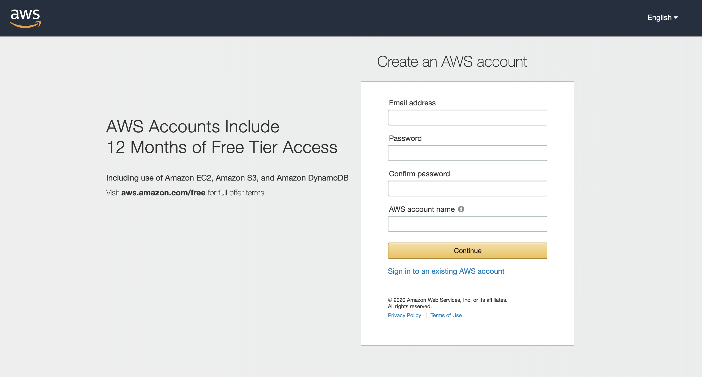</p>
  <p>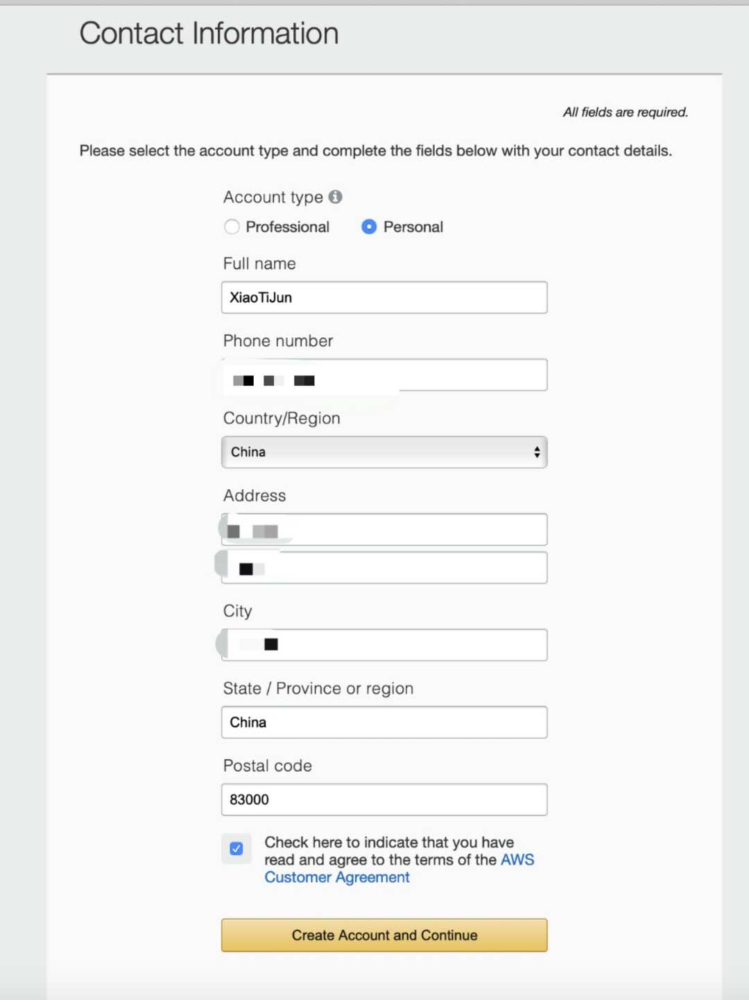</p>
- 绑定信用卡后亚马逊官方会冻结1$，一年后归还冻结金额
  <p>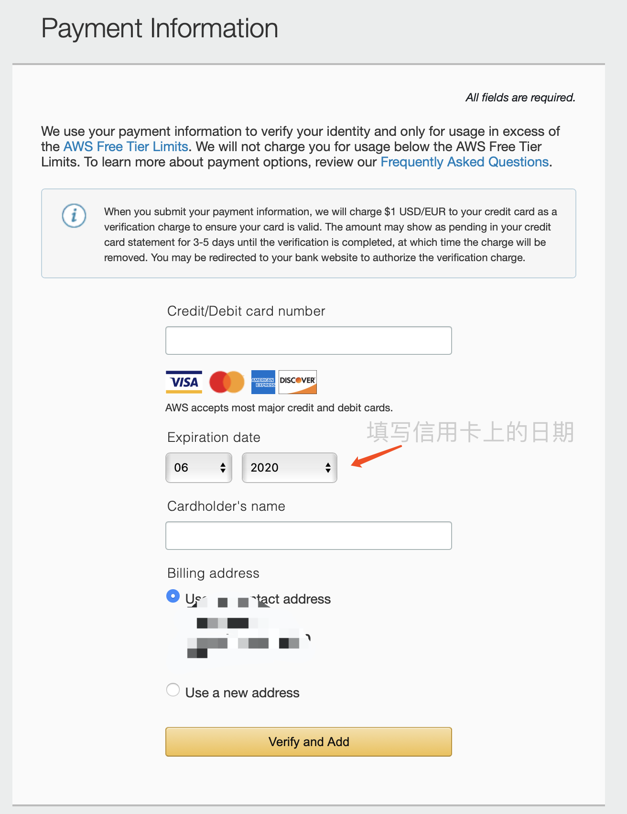</p>


- 服务器选型（注册完成后进入控制台选择，在这之前可以先去亚马逊各节点服务器[测速网站](https://www.cloudping.info/)查看ping值最低的区域，然后在此区域上搭建VPS速度将会更快。此示例选择的是香港地区服务器：
 
    <p>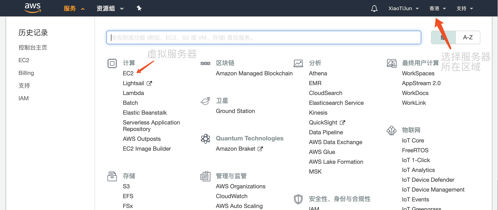</p>   

    <p>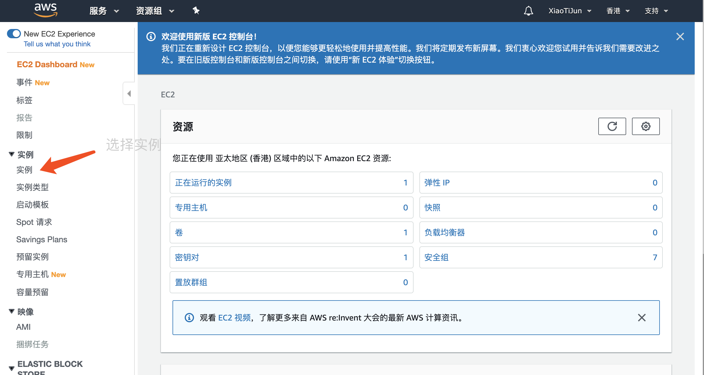</p>

    <p>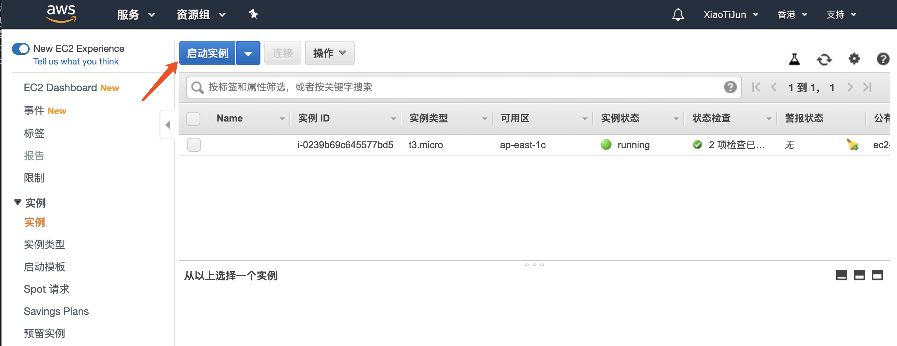</p>

    <p>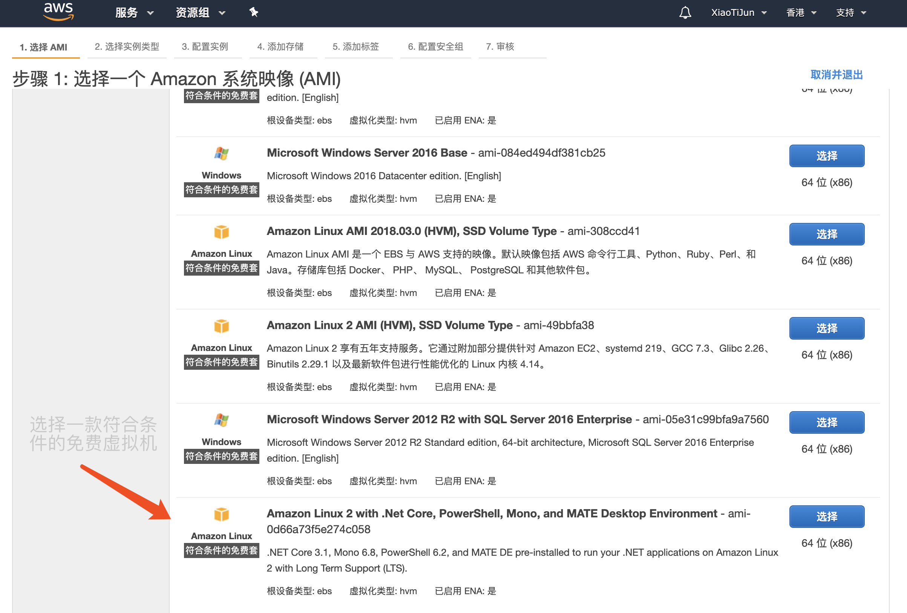</p>

    <p>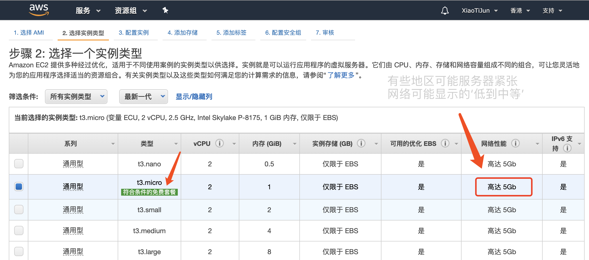</p>

    <p>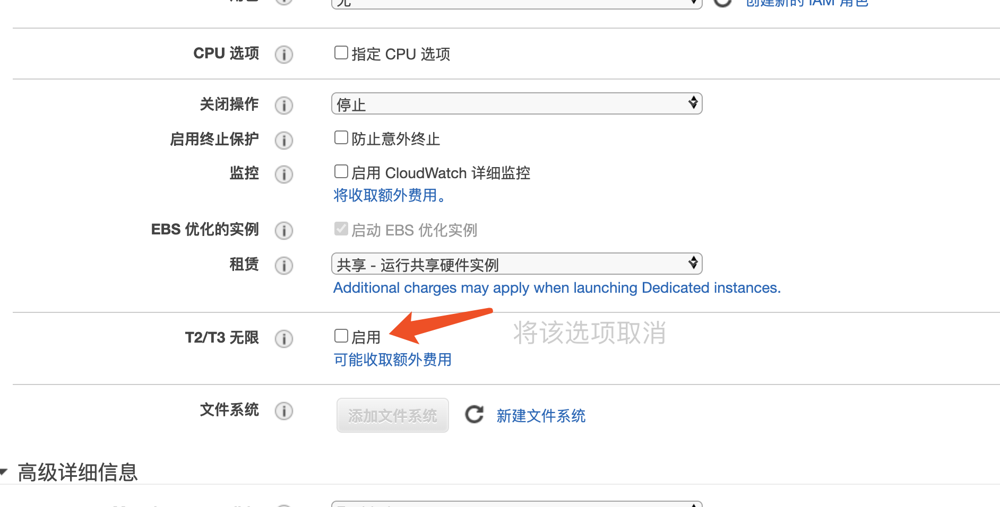</p>

    <p>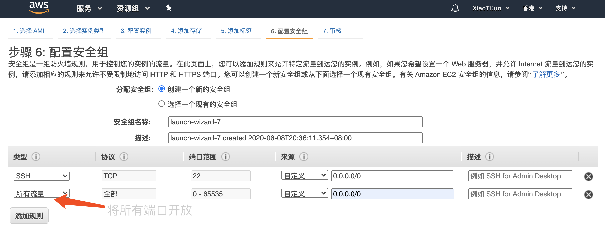</p>
- <p style="color:red">第一次时它会让你新建一个密钥对，下载下来时时txt格式，你需要将后缀改为pem</p>
    <p>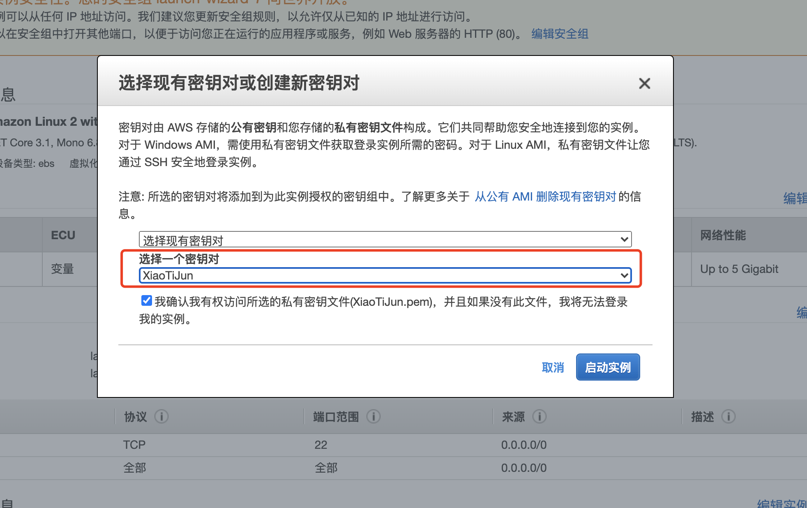</p>

- 启动实例（此教程用的mac OS自带终端启动）
    <p>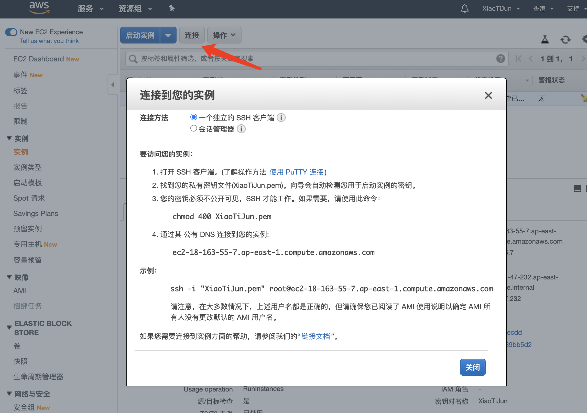</p>

    <p>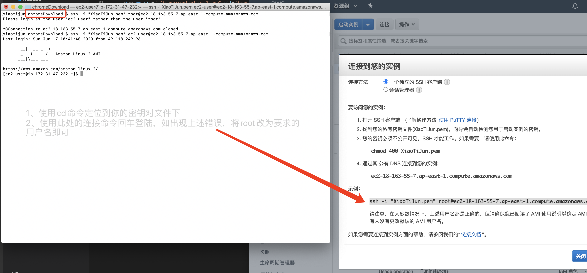</p>

## II、安装shadowsocks（python版）适合centos7-8
  
    # 插件安装
    yum -y groupinstall development

    yum install -y zlib-devel bzip2-devel openssl-devel ncurses-devel sqlite-devel readline-devel tk-devel

    yum install -y git

    # 创建python目录
    mkdir python
    cd python

    # 下载python包
    wget https://www.python.org/ftp/python/3.6.4/Python-3.6.4.tgz
    
    # 解压
    tar -xvf Python-3.6.4.tgz

    cd Python-3.6.4

    # 编译
    ./configure --prefix=/usr/local/python3

    make && make install

    # 加入系统全局变量，重启后失效，如果需要可以进入/etc/profile修改
    export PATH=$PATH:/usr/local/python3/bin/

    # 下载脚本
    curl "https://bootstrap.pypa.io/get-pip.py" -o "get-pip.py" 

    # 编译脚本
    python3 get-pip.py

    # 安装shadowsocks
    pip install git+https://github.com/shadowsocks/shadowsocks.git@master

    # 创建配置文件
    mkdir shadowsocks
    cd shadowsocks
    vim config.json

    # 填入参数
    {
        "server": "0.0.0.0",            
        "server_port": 9001,            // 端口号
        "local_address": "127.0.0.1",
        "local_port": 1080,
        "password": "yourpassword",   // 密码
        "timeout": 500,
        "method": "aes-256-cfb",        // 加密方式
        "fast_open": false,
        "workers": 1
    }

    # 启动shadowsocks
    ssserver -c ./config.json -d start
    # 或者
    nohup ssserver -c /home/ec2-user/python/shadowsocks/config.json >log.log 2>&1 &

    # 查看端口(出现下图就说明启动成功)
    netstat -tunlp | grep python
    
<p>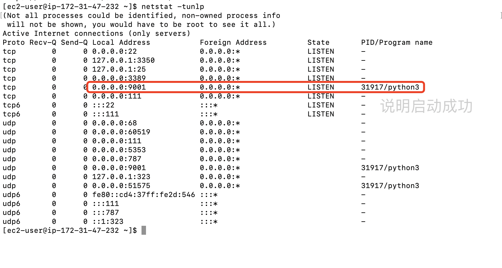</p>

-  第二种安装方式 (脚本安装):
```
  wget https://raw.githubusercontent.com/XiaoTiJun/ExperienceSharing/master/VPS/bin/installSocks.sh

  chmod a+x installSocks.sh

  ./installSocks.sh

  wget https://raw.githubusercontent.com/XiaoTiJun/ExperienceSharing/master/VPS/bin/setPort.sh

  chmod a+x setPort.sh

  ./setPort.sh
```

## III、客户端安装
  
- [MAC版包下载](https://github.com/shadowsocks/ShadowsocksX-NG/releases)
- [IOS版包下载](https://shadowsockshelp.github.io/ios/)
- [Android版包下载](https://github.com/shadowsocks/shadowsocks-android/releases)
- [Window版包下载](https://github.com/shadowsocks/shadowsocks-windows/releases)

## IV、客户端配置 (MAC为例)
<p></p>

## 附录
-  当你使用一段时间后发现突然无法上网，可能就是你的端口被GFW检测时封掉了，你可上[端口查询](http://port.ping.pe/)网站看看你的端口是否被封，<p style="color:red">如若被封，将端口号换一个在重启ssserver即可!</p>

<p>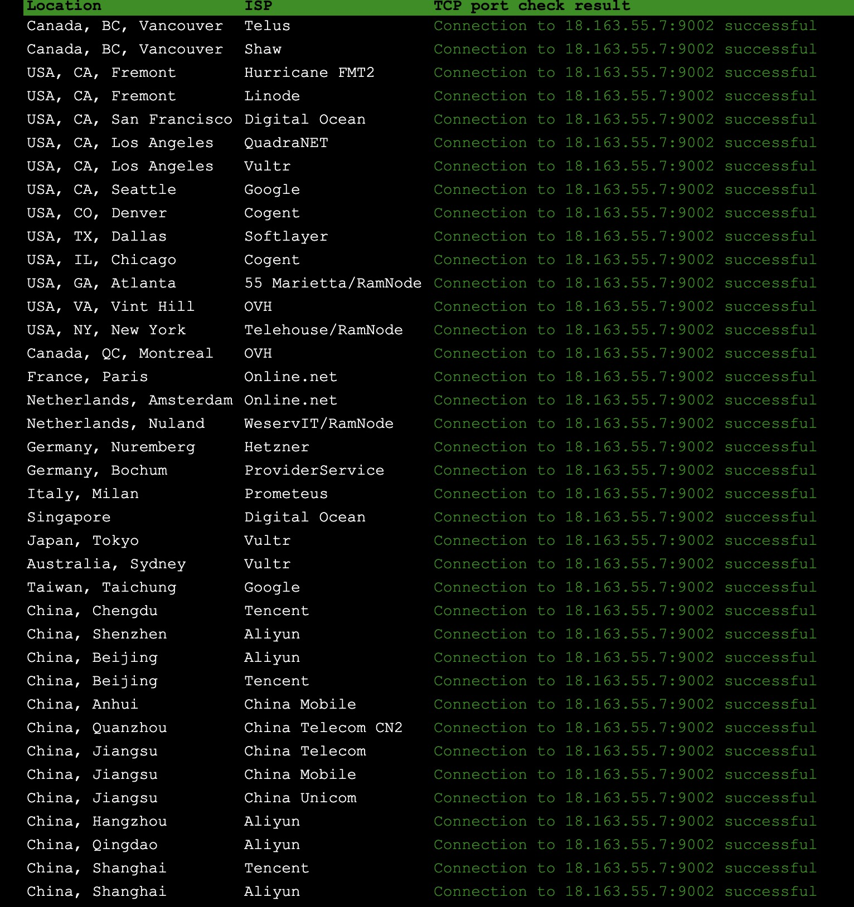</p>
  
-  这种情况就说明9002端口已经被国内封掉了

<p>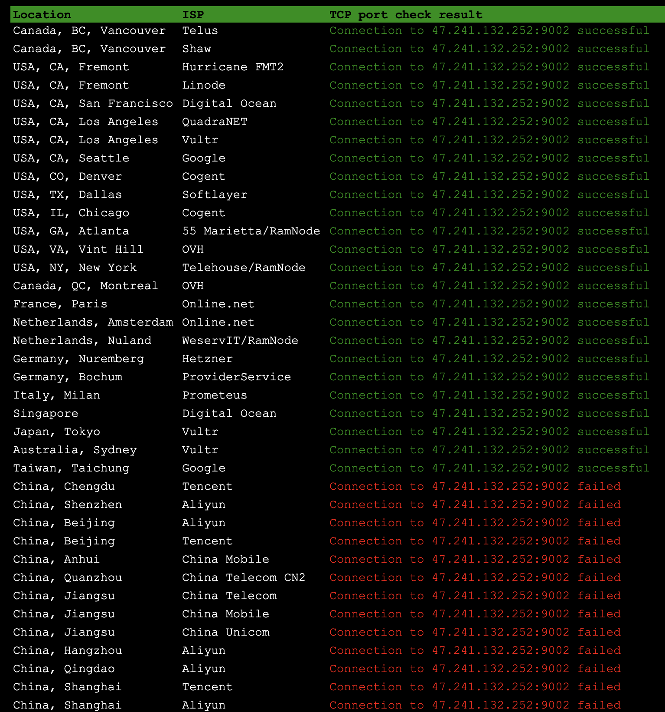</p>

# END
- 若对你有所帮助，帮忙点个star。❤️❤️❤️
- File bugs, problems requests in [GitHub Issues](https://github.com/XiaoTiJun/ExperienceSharing/issues).