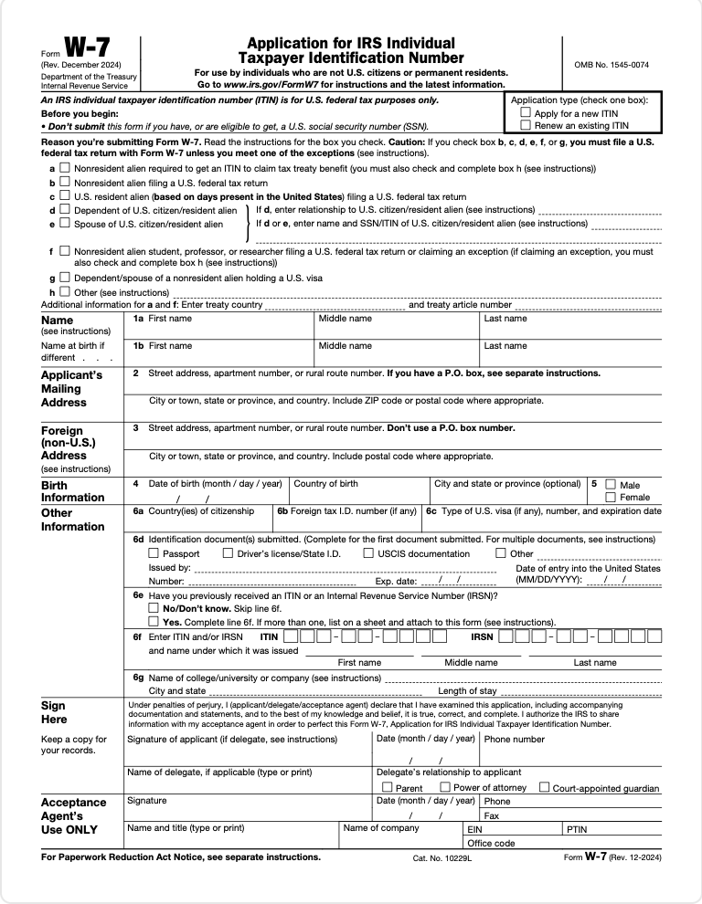
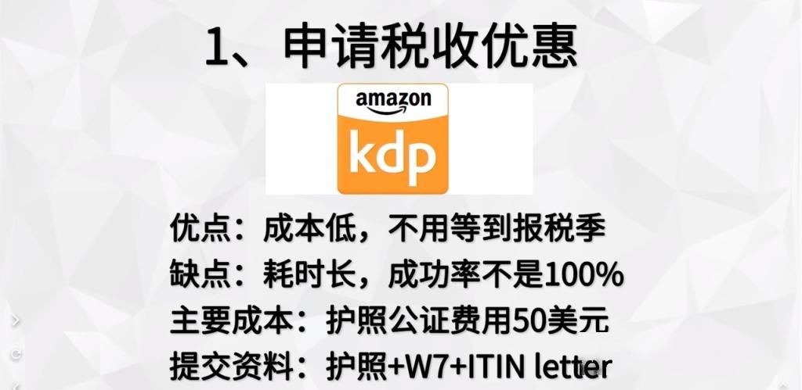
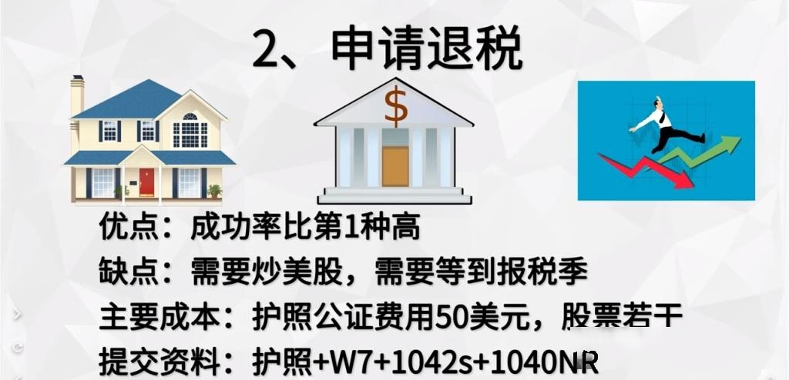
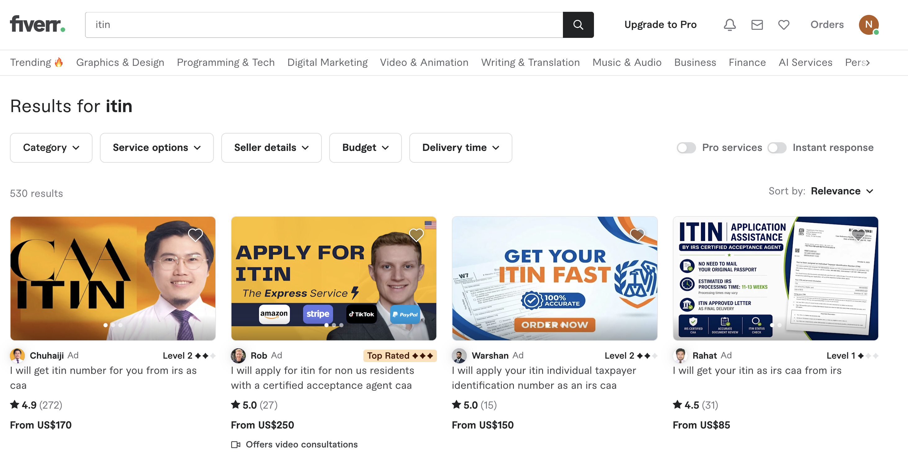

# 国内如何申请ITIN（美国个人税号）

> 文章原地址：[https://zhuanlan.zhihu.com/p/507516151](https://zhuanlan.zhihu.com/p/507516151) 
> 美国国税局IRS链接：[https://www.irs.gov/zh-hans/tin/itin/individual-taxpayer-identification-number-itin](https://www.irs.gov/zh-hans/tin/itin/individual-taxpayer-identification-number-itin
)
---

目录

* [ITIN简介](https://wzproject.com/how-to-apply-itin/#ITIN%E7%AE%80%E4%BB%8B)
* [需要申请ITIN的常见情况](https://wzproject.com/how-to-apply-itin/#%E9%9C%80%E8%A6%81%E7%94%B3%E8%AF%B7ITIN%E7%9A%84%E5%B8%B8%E8%A7%81%E6%83%85%E5%86%B5)
* [可使用ITIN申请的美国银行账户和信用卡](https://wzproject.com/how-to-apply-itin/#%E5%8F%AF%E4%BD%BF%E7%94%A8ITIN%E7%94%B3%E8%AF%B7%E7%9A%84%E7%BE%8E%E5%9B%BD%E9%93%B6%E8%A1%8C%E8%B4%A6%E6%88%B7%E5%92%8C%E4%BF%A1%E7%94%A8%E5%8D%A1)
* [2026年申请ITIN需要的文件](https://wzproject.com/how-to-apply-itin/#2022%E5%B9%B4%E7%94%B3%E8%AF%B7ITIN%E9%9C%80%E8%A6%81%E7%9A%84%E6%96%87%E4%BB%B6)
* [办理ITIN的4种方法](https://wzproject.com/how-to-apply-itin/#%E5%8A%9E%E7%90%86ITIN%E7%9A%844%E7%A7%8D%E6%96%B9%E6%B3%95)

* [通过Fiverr找CAA办理ITIN](https://wzproject.com/how-to-apply-itin/#%E9%80%9A%E8%BF%87Fiverr%E6%89%BECAA%E5%8A%9E%E7%90%86ITIN)

## ITIN简介

根据 IRS 官网的[介绍](https://www.irs.gov/zh-hans/individuals/individual-taxpayer-identification-number)，ITIN 的英文全称是（Individual Taxpayer Identification Number），官方中文名称是 **个人报税识别号码** ，一般简称 **美国** [个人税号](https://wzproject.com/tag/%e4%b8%aa%e4%ba%ba%e7%a8%8e%e5%8f%b7/)，还有个叫法叫做 **CP-565** 。ITIN其实就是美国国税局（Internal Revenue Service, IRS）针对没有资格申请SSN，但是有报税要求的人士而专门设立的号码。

在IRS的官方定义 ITIN 除了申报联邦税务外没有其它用途，不能用它在美国肉身合法进行工作，更不能作为享受美国社会保障福利的资格。但随着 ITIN 的普及，一些美国的本土银行也逐渐接受 ITIN 做为 SSN 的代替身份认证文件，以批准外籍人士申请美国本土银行账户和信用卡。需要了解的是，以ITIN 方式申请银行账户并非 IRS 的准许，这是属于银行单方面的操作，使用 ITIN 方式申请银行账户和信用卡时，可能还需要但不局限护照或驾照、水电账单、美国私人地址、B1/B2 签证等证明文件。

> IRS 全称 Internal Revenue Service, 即美国国家税务局，隶属于美国财政部。

## **需要申请ITIN的常见情况**

* 外国人在美国有房屋出租、银行利息等收入，需要报税；
* 外国人在美国买卖房屋；
* 外国人在美国开公司或者有公司分红收入；
* 外国人想申请美国信用卡和[美国银行](https://wzproject.com/tag/%e7%be%8e%e5%9b%bd%e9%93%b6%e8%a1%8c/)账户。

## 可使用ITIN申请的美国银行账户和信用卡

**美国银行账户**

* Monzo
* Revolut
* Citi Checking
* Capital One Checking
* Fidelity Checking
* Schwab HYI Checking
* U.S. Bank Checking
* Sable Checking
* GO2Bank Checking
* Cheese Checking
* HSBC Checking
* Passbook Checking（[Passbook开户教程](https://wzproject.com/passbook-register/)）

**信用卡**

* [Apple Card苹果信用卡](https://card.apple.com/apply/start)
* Bank Of America美国银行
* Citibank Bank Secured花旗银行
* Capital One Secured美国第一资本金融公司
* Chase大通银行
* American Express美国运通
* PAYPAL Credit
* Venmo Credit
* Sable Secured
* GO2Bank Credit
* Alliant Credit Union
* Digital Federal Credit Union

**拒绝 ITIN 做为 SSN 的代替身份认证文件的美国银行如下：**

* Barclaycard
* Discover
* Wells Fargo（不含 Secured Card）

以 ITIN 方式来申请银行账户主要为中国大陆玩家居多，大部分都是先用ITIN 申请美国押金卡（Secured Card），之后再转正，即办理标准的美国标准信用卡，由此来建立美国个人信用。IRS 可批准 ITIN 用于申请 EIN，所以一些个人做跨境电商的也会去申请 ITIN。

## 2026年申请ITIN需要的文件

首先需要的就是W7表格了！

> W7表格介绍
> [https://www.irs.gov/zh-hans/forms-pubs/about-form-w-7](https://www.irs.gov/zh-hans/forms-pubs/about-form-w-7)
> 

今年IRS简化了取得 ITIN 时可受理的身份识别文件和外籍人士身份证明的种类。可受理的文件共有 13 种。每种文件必须现行有效，并且包含到期日。文件必须显示您的姓名和照片，并支持您宣称的外籍人士身份。如果您在递交 ITIN 申请后 60 天内出于任何原因需要取回正本，您可能希望本人向国税局纳税人协助中心或CAA提出申请。您也可以递交经发证机关核证的副本。以下是受理的文件清单：

* **护照** （独立文件）*
* **国民身份证** （必须显示照片、姓名、现行地址、生日和到期日）
* 美国驾照
* 公民出生证明（18 岁以下的被抚养人所需）
* **外国驾照**
* 美国州身份证
* 外国选民登记卡
* 美国军人身份证
* 外国军人身份证
* **签证**
* 美国公民和移民服务局 (USCIS) 带照片的身份证
* 病历（仅限被抚养人-6 岁以下）
* 学校纪录（仅限被抚养人-14 岁以下，或为学生则 18 岁以下）

***护照是唯一能证明身份和外籍人士身份的文件。如果未提交护照，则必须提供两种或多种文件以符合文件要求。**

> 具体要求查看官网介绍：
> [https://www.irs.gov/zh-hans/individuals/revised-application-standards-for-itins](https://www.irs.gov/zh-hans/individuals/revised-application-standards-for-itins)

从上我们可以看出，在国内的我们能够得到就是 **护照、中国身份证、中国驾照、签证** 。

根据笔者的咨询美国专业税务师，两种情况就可以申请ITIN！

**一是如果你有护照，只需提供护照就可以申请ITIN了。** 现阶段确实护照不好办理！

二是如果你没有护照，当然没有护照，你肯定也是没有签证了。 **现在你提供中国身份证和中国驾照就可以申请ITIN了。** 这两个证件都是中文的，需要提交的时候需要经过专业的翻译公证机构公证。

## 办理ITIN的4种方法

### 1申请税收优惠的方式

图示主要是在亚马逊通过销售电子书的方式来获得的。注意护照公证是需要到美国大使馆进行公证的。

### 2通过美股券商股息退税的方式来申请

一般美股券商都是按照30%的税来扣税的，但是中美之间有税率协定，这些税可以按照10%来收取，办理ITIN就可以让券商给你退20%的税。

这个方式网上有很多教程，主要就是使用炒美股人员来申请的，注意要美国本土券商才行，比如德美力、盈透等，国内老虎证券这种不行！

### 3通过美国公司申请ITIN

通过申请一个美国公司，你本人是公司的法人或者股东，把公司利润划转到个人利润上的来的话，就需要申请ITIN来报税了，我们就可以以这种方式名正言顺申请ITIN。

### 4通过机构代为申请ITIN

代理机构分为AA和CAA，简单说两个区别就是：

AA需要你寄护照原件或者公证件给他，他帮你办理，办理下来后IRS会给你填的地址寄一份ITIN确认信。

CAA是IRS的认证机构，你只需要提供护照扫描件（无护照就是驾照和身份证扫描件），他帮你办理，办理下来后IRS会给你填的地址和CAA的地址各自寄一份ITIN确认信。

笔者是通过Fiverr上的CAA帮忙办理的ITIN，这个方式确实方便，其他步骤都不需要，只需提供证件扫描件就行，办理时间现在一般为8—12周。

## 通过Fiverr找CAA办理ITIN

Fiverr是一个创新的自由职业者平台、领先的在线服务市场、在纽交所上市的金融技术公司，提供被称为“工作”的几种服务，自由职业者可以向世界各地的买家列出和宣传他们的数字服务，并为他们的买家完成工作来获取相应报酬。 **Fiverr平台当然也有来自美国本土的专业报税员或会计师、美国国税局的认证代理，可以帮助你申请ITIN，远程开设你在美国的公司，可以帮助你申报个人和企业所得税，而且你不需要是美国居民** 。总之，在Fiverr上你可以找到跨境从业者需要的所有英文类资源。

关于如何申请Fiverr账号，过程非常简单，可以直接点击 [注册链接](https://www.fiverr.com/pe/1qr2NvK) 注册，只需邮箱即可完成注册。

### CAA办理ITIN的流程

一般需要提供以下资料：

1. 护照扫描件或者（ **中国身份证+中国驾照** ）
2. [提供了美国地址-Anytimemailbox美国地址](https://wzproject.com/anytimemailbox-jiaoxue/)
3. 中国的地址-居住地址，没有实际用途。
4. 美国电话号码

上传资料后，等待3天左右，代理完成1040表格和W7表格后，通过Fiverr上传，然后通知你签字。

分别在以下2处签上你的姓名，一般写拼音

* 1040：第二页Sign Here   /Your signature
* W7：Sign Here/ Signature Of appliceant

将以上2页通过PDF签名或者打印签名，然后上传Fiverr，完成以上步骤后，找代理预约时间视频会议，认证护照。

会议的过程很简单，英语不好也不必担心，只需要将护照首页对着镜头，让她确认你是你即可。会议完成，整个ITIN申请过程就算完成了，提供一个邮箱给代理方便日后沟通，然后耐心等待ITIN Letter运抵[Anytimemailbox美国地址](https://wzproject.com/anytimemailbox-jiaoxue/)，目前需要3-11周左右。

### 在fiverr搜索ITIN，找到评分高有视频会议的就好

**另外，本文需要加两条免责声明：**

1. **本文介绍的都是合法申请ITIN的途径，没有任何违法的内容；但是还是请不要滥用，任何滥用导致的法律后果需自己承担。**
2. **笔者并不是注册会计师，如果有报税方面的问题或者申请ITIN的实际操作，还请咨询注册会计师或者税务律师，得到专业回答。**

以上！
