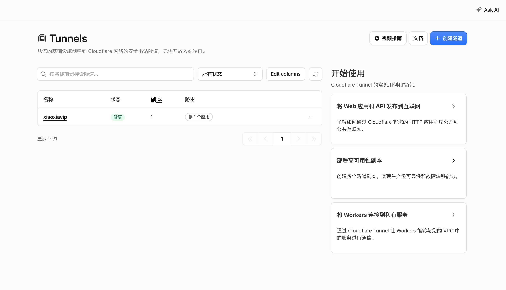
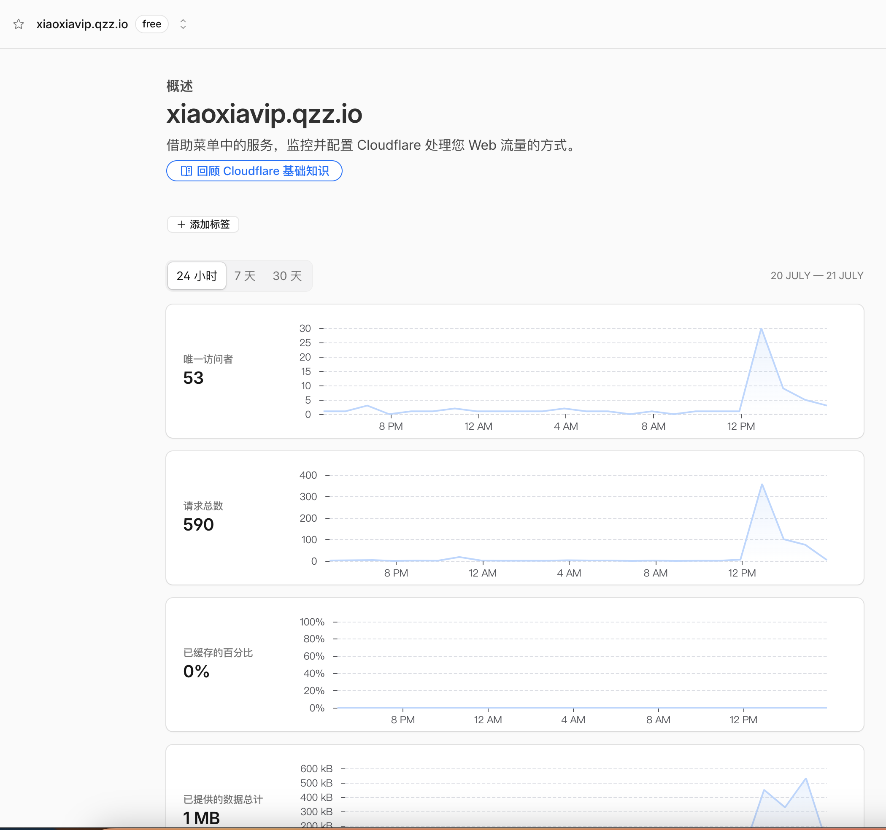
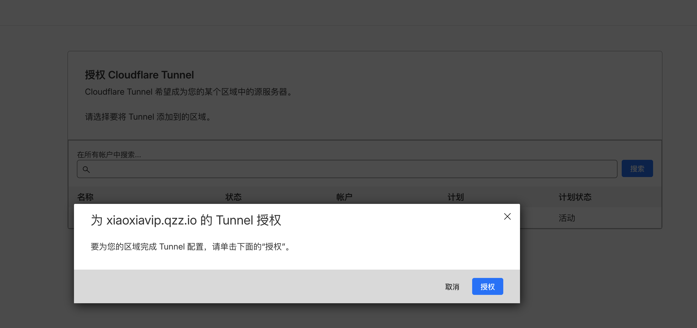
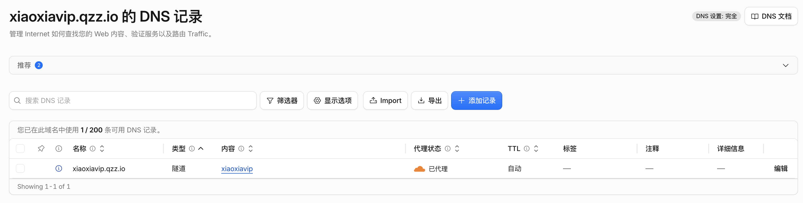

# 443 被占用时：用 Cloudflare Tunnel 给非标准端口服务上 HTTPS

服务器 443 端口已被其他应用占用时，仍可为本地服务（如 `8843`）暴露公网 HTTPS 访问。借助 Cloudflare Tunnel（`cloudflared`），无需开放额外入站端口，也无需自行申请证书，由 Cloudflare 完成入口、DNS 与 TLS 终止。

本文同时给出 **Dashboard 图形化配置** 与 **CLI 手动配置** 两种方式，可按习惯二选一。

## 目录

- [方式一：Dashboard 图形化配置（推荐）](#方式一dashboard-图形化配置推荐)
- [方式二：CLI 手动配置](#方式二cli-手动配置)
  - [1. 在 Cloudflare 中添加域名](#1-在-cloudflare-中添加域名)
  - [2. 在服务器上安装 cloudflared](#2-在服务器上安装-cloudflared)
  - [3. 登录 Cloudflare](#3-登录-cloudflare)
  - [4. 创建 Tunnel](#4-创建-tunnel)
  - [5. 编写配置文件](#5-编写配置文件)
  - [6. 创建 DNS 路由](#6-创建-dns-路由)
  - [7. 安装并启动服务](#7-安装并启动服务)

---

## 方式一：Dashboard 图形化配置（推荐）



Cloudflare 已提供 Tunnel 的图形界面，整个过程几乎不用手写配置文件：

1. 登录 [Cloudflare Dashboard](https://dash.cloudflare.com/)。
2. 进入 **Networks → Tunnels**。
3. 点击 **Create a tunnel**，选择 **Cloudflared**。
4. 按页面提示在服务器上安装 `cloudflared`，并执行给出的接入命令，将本机加入该 Tunnel。
5. 在 Tunnel 的 **Public Hostname** 中添加映射，例如：

```text
Hostname：xiaoxiavip.qzz.io
Service Type：HTTP 或 HTTPS（按后端实际协议选择）
URL：localhost:8843
# 若后端是 HTTPS，则填写：https://localhost:8843
```

完成后，Cloudflare 会自动创建 DNS 记录并完成路由，一般无需再手动维护 `config.yml`。

---

## 方式二：CLI 手动配置

适合需要版本化配置、脚本化部署，或 Dashboard 不便操作的场景。

### 1. 在 Cloudflare 中添加域名

先在 Cloudflare 域名列表中接入（挂载）你的域名。



### 2. 在服务器上安装 cloudflared

**CentOS / RHEL：**

```bash
sudo rpm -ivh https://github.com/cloudflare/cloudflared/releases/latest/download/cloudflared-linux-x86_64.rpm
```

或分两步下载再安装：

```bash
wget https://github.com/cloudflare/cloudflared/releases/latest/download/cloudflared-linux-x86_64.rpm
sudo rpm -ivh cloudflared-linux-x86_64.rpm
```

安装完成后验证版本：

```bash
cloudflared --version
# 示例输出：
# cloudflared version 2026.7.2 (built 2026-07-15-13:29 UTC)
```

### 3. 登录 Cloudflare

```bash
cloudflared tunnel login
# 终端会打印一个 URL，复制到浏览器完成登录授权
# Please open the following URL...
# https://dash.cloudflare.com/...
```

登录成功后会出现授权页面，选择你已在 Cloudflare 中接入的域名即可。



### 4. 创建 Tunnel

```bash
cloudflared tunnel create <隧道名称>
# 会输出 Tunnel UUID，例如：
# Tunnel UUID: xxxxxxxx-xxxx-xxxx-xxxx-xxxxxxxxxxxx
```

请记下该 UUID，后续配置文件会用到。

### 5. 编写配置文件

```bash
mkdir -p ~/.cloudflared
vi ~/.cloudflared/config.yml
```

写入如下内容（将 `tunnel` 与 `credentials-file` 中的 UUID 换成上一步输出）：

```yaml
tunnel: xxxxxxxx-xxxx-xxxx-xxxx-xxxxxxxxxxxx
credentials-file: /root/.cloudflared/xxxxxxxx-xxxx-xxxx-xxxx-xxxxxxxxxxxx.json

ingress:
  - hostname: xiaoxiavip.qzz.io   # 对外暴露的域名
    service: https://127.0.0.1:8843  # 本地服务；若经 Nginx 反代到 8843 的 SSL，可写 https
    originRequest:                   # 仅 HTTPS 后端需要；纯 HTTP 可删掉这两行
      noTLSVerify: true
  - service: http_status:404         # 兜底规则，必须放在最后
```

说明：

- `service` 也可以是 `http://127.0.0.1:8843`，按本地实际协议填写。
- 若源站使用自签证书，`noTLSVerify: true` 可避免 `cloudflared` 因证书校验失败而连不上后端。

### 6. 创建 DNS 路由

```bash
cloudflared tunnel route dns <隧道名称> xiaoxiavip.qzz.io
```

该命令会在 Cloudflare 中自动创建一条指向该 Tunnel 的 CNAME 记录。



### 7. 安装并启动服务

```bash
# 安装为系统服务
cloudflared service install

# 开机自启
systemctl enable cloudflared

# 启动
systemctl start cloudflared

# 查看状态
systemctl status cloudflared
```

服务正常后，即可通过 `https://xiaoxiavip.qzz.io` 访问本地 `8843` 上的应用，而无需占用服务器的 443 端口。
