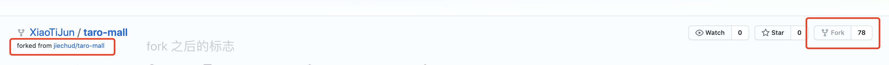
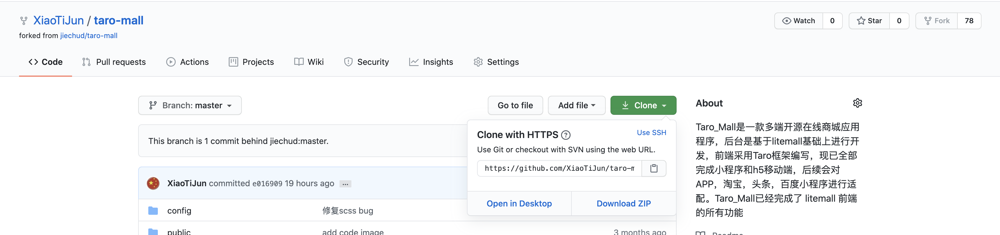
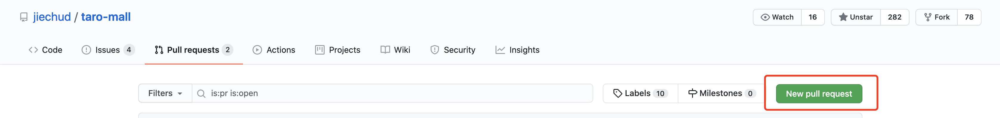

# 提交pull request合并分支请求给开源项目
- 大家可能有这种经历，使用别人的开源项目时发现了bug并成功的修改后可能无权限提交的情况，所以今天我就来分享一下我使用的操作。
- fork & pull request： 具体流程就是先fork对方的开源项目到自己的仓库里，然后将自己的仓库代码拉下，新建一个分支（该分支用来pull request），然后在新建的分支下修改bug，修改完成之后便push分支到自己仓库中的代码上，然后在去对方的页面上提交pull request请求即可。

### 目录
- [提交pull request合并分支请求给开源项目](#提交pull-request合并分支请求给开源项目)
    - [目录](#目录)
  - [1、先fork你需要修改的开源项目](#1先fork你需要修改的开源项目)
  - [2、git clone fork过来的项目路径](#2git-clone-fork过来的项目路径)
  - [3、新建项目分支（用来当作pull request合并的分支）](#3新建项目分支用来当作pull-request合并的分支)
  - [4、commit & push 该分支](#4commit--push-该分支)
  - [5、去源项目下创建一个pull request，然后等待管理员将你的请求合并即可](#5去源项目下创建一个pull-request然后等待管理员将你的请求合并即可)
- [END](#end)


## 1、先fork你需要修改的开源项目

<p></p>
    <center style="font-size:12px;color:#666;text-decoration:underline;margin-bottom:10px">fork开源项目</center>

## 2、git clone fork过来的项目路径

<p></p>
    <center style="font-size:12px;color:#666;text-decoration:underline;margin-bottom:10px">git clone项目</center>

```
git clone https://github.com/XiaoTiJun/taro-mall.git
```

## 3、新建项目分支（用来当作pull request合并的分支）
```
git checkout -b 分支名字
```

## 4、commit & push 该分支
```
git commit -m 'fix bug'

git push -u origin 分支名字

# 如若没有权限，则添加一个新的推送地址
git remote add upstream https://github.com/jiechud/taro-mall.git
```

## 5、去源项目下创建一个pull request，然后等待管理员将你的请求合并即可

<p></p>
    <center style="font-size:12px;color:#666;text-decoration:underline;margin-bottom:10px">提交pull request</center>

合并之后github便会通过你所绑定的账号邮箱通知你，此时你也是该开源项目中的 [Contributions](https://github.com/XiaoTiJun/ExperienceSharing/graphs/contributors) 之一了。


# END
- 若对你有所帮助，帮忙点个star。❤️❤️❤️
- File bugs, problems requests in [GitHub Issues](https://github.com/XiaoTiJun/ExperienceSharing/issues).