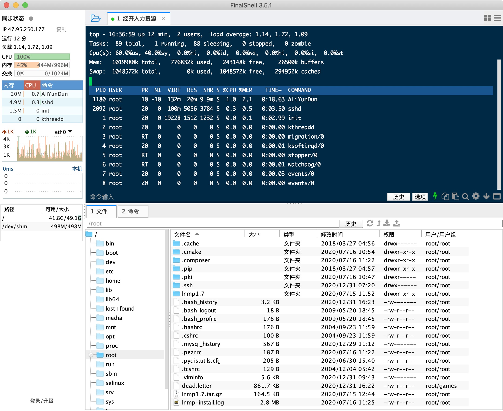
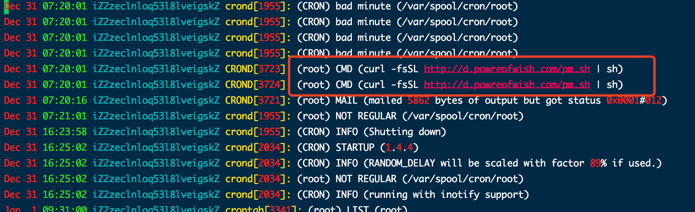
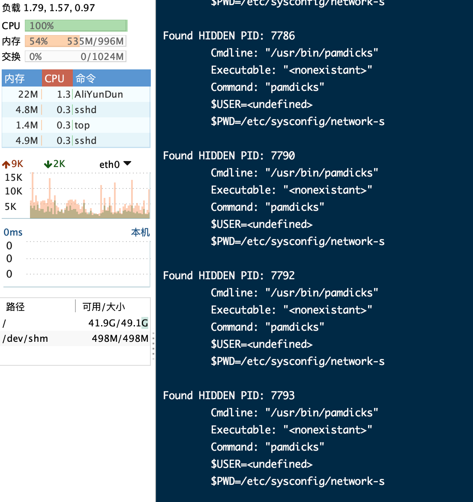

# 记一次阿里云服务器redis被植入pamdicks挖矿木马解决经历
前言： &nbsp;&nbsp;&nbsp;&nbsp;&nbsp;&nbsp;&nbsp;&nbsp;&nbsp;
本人服务器小白，今日接到上头命令需要对甲方的一个官网进行整改，对接了上一家的服务器之后我便开始了我的工作，进入服务器部署各相关的插件，当一切就绪后，第二天使用服务器时发现运行的异常缓慢，查看各监测指标发现12月31日早上7:30分左右服务器CPU占用飙升100%，随后就进行了Google+百度+Stark OverFlow搜索游戏。
## 一、使用top+ps命令查看高占用CPU的进程
1、使用`top -c`或`ps aux | sort -k3nr | head -n 10`查看CPU占用，但是我这显示出并没有CPU占用过高的进程，所以进行下一步排查。

## 二、网上搜索相关问题
&nbsp;&nbsp;&nbsp;&nbsp;&nbsp;&nbsp;在第一步的出师不利之后，我在网上搜索查处有一种叫`kdevtmpfsi`的病毒，根据网上的资料进行查找，发现在 `/tmp` 目录下有这文件，当时以为终于找到了源头当即就进行`rm -rf`的删除，但是发现提示无法删除，查阅资料后发现被使用`chattr +i`命令就行锁定了，但当我用`chattr -i`解锁时系统却提示我 `-bash: chattr: command not found`！！！ 
&nbsp;&nbsp;&nbsp;&nbsp;&nbsp;&nbsp;这个入侵病毒真的一绝，使用了命令后竟然还把他给删了，虽然又是一顿搜索，发现一种解决方法，可以使用[chattr的源码文件](https://github.com/posborne/linux-programming-interface-exercises/blob/master/15-file-attributes/chattr.c)进行编译，步骤如下： 
1、打开链接将源文件内容粘贴。 
2、进入自己的linux服务器使用`vim chattr.c`命令将粘贴的内容复制。 
3、然后使用`cc chattr.c`得到`a.out`文件，使用`mv a.out chattr`更名，在使用`mv chattr /usr/bin/`将编译后的chattr文件移入/usr/bin/全局命令下。（注： 使用cc命令需要安装gcc的插件，如何安装请自行搜索）。 
4、然后就可以进行`chattr -i [文件名]`修改权限，之后使用`rm -rf [文件名]`删除。

## 三、找到病毒本体
&nbsp;&nbsp;&nbsp;&nbsp;&nbsp;&nbsp;就在我删除最后一个文件并重启服务器后，CPU占用率依然是显赫的100%，这让我的心情顿时跌入谷底，但是问题没有解决，同志任需努力，凭着这口气，我开始重整旗鼓，进行历史命令搜索，当然，一般的黑客都会删除像history和登陆日志的记录，但当我找到`/var/log/cron`文件时，一个两眼的命令出现在我面前。

这个文件我下下来看一了一下，大体就是安装`pamdicks`病毒和`kdevtmpfsi`虚晃文件，[感兴趣的朋友可以下载来看看](http://d.powreofwish.com/pm.sh),其中还有一个`unhide`的插件，我看到这个后顿时眼前一亮，虽然曾怀疑过可能是有人隐藏过进程，但是当时我在阿里云上提交了一个工单，上面的技术人员说可以让我下载一个htop的插件查看进程，我下载后发现并没有过高的CPU占用进程，我就忽略了这个问题。此时我相信我已经找到了问题的根源了，随后用`unhide proc`命令查看所以隐藏进程，发现如下几个任务:

当时我就笑了，哼，还是被我逮着了吧。

但奈何技术有限，修改内核这个玩不转，也未找到相关反向修改的案例。
只能想出其他办法解决该问题。

当检测该文件时发现使用搜索的方式都无法检测到该文件，`find` ，`ls /usr/bin/pamd*`等等都无法显示，唯有全路径才可以`ls -hal /usr/bin/pamdicks`发现这个文件。

解决办法：

- 根据系统环境变量，检查各目录下是否存在`pamdicks`共计有两个`/usr/bin/pamdicks`和`/bin/pamdicks`

- 删除原文件，并创建一个顶包空文件，然后使用系统chattr对其进行锁定禁止修改。 
`rm -rf /usr/bin/pamdicks /bin/pamdicks` 
`touch /usr/bin/pamdicks /bin/pamdicks` 
`chattr +i /usr/bin/pamdicks /bin/pamdicks` 
- 再根据`unhide proc`查找出来的PID然后干掉它
- `kill -9 7786`

从此，世界又重归于清净，这次解决bug也让我学到了很多，例如在将来的服务器上要更加注意保密和端口的开放和IP白名单的释放等等。我相信当一名程序员遇到真正难解决的bug时是兴奋和激动的，就像小时候解不出的数学题，永远都充满着新鲜。

# END
- 若对你有所帮助，帮忙点个star。❤️❤️❤️
- File bugs, problems requests in [GitHub Issues](https://github.com/XiaoTiJun/ExperienceSharing/issues).