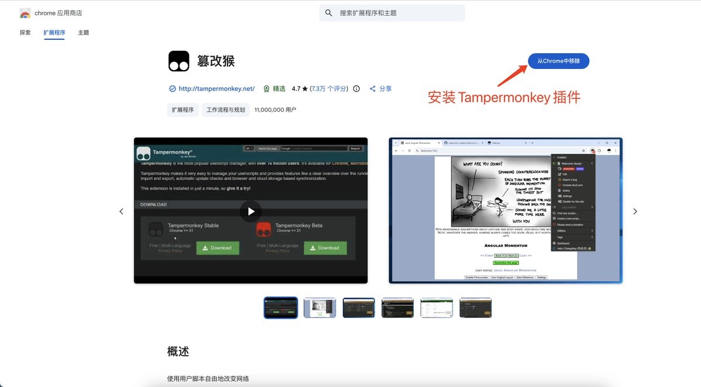
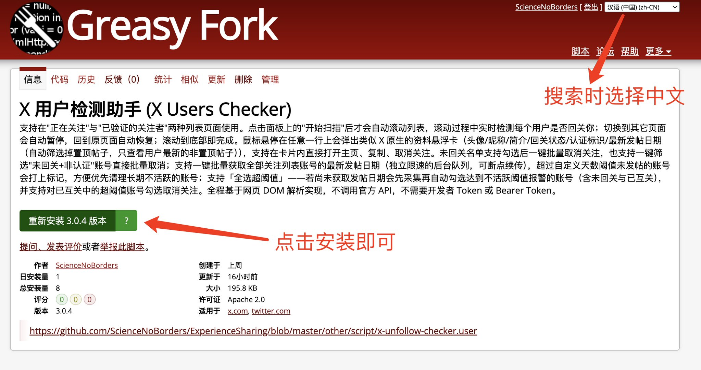
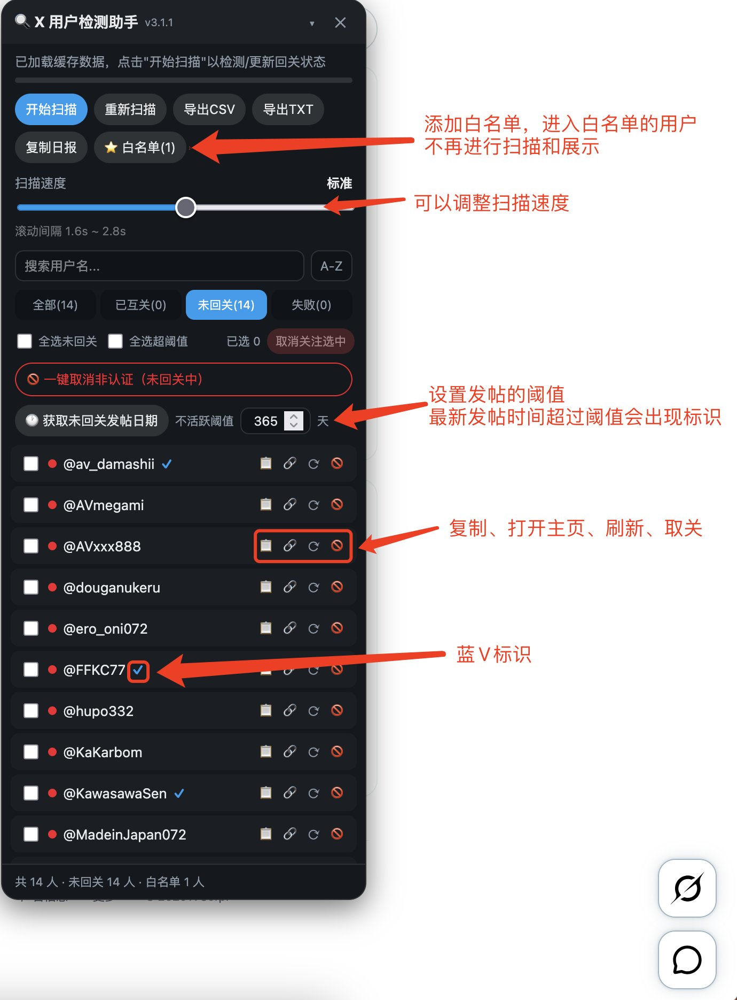
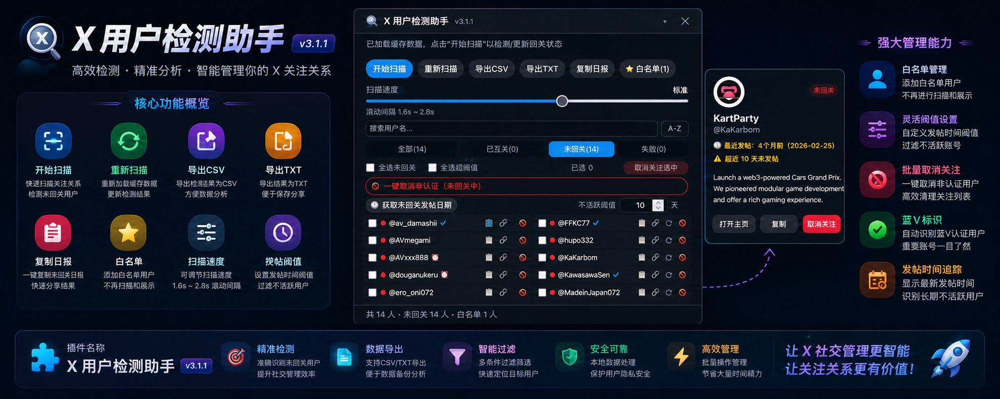

# X 用户检测助手 (X Users Checker) 使用指南

在X平台上，蓝V认证早已成为身份与影响力的象征。拥有蓝V的账号往往能获得更多曝光、信任与合作机会，但随之而来的问题是：关注列表越来越长，如何高效判断哪些人是真正活跃账户，哪些账户多长时间未发表帖子和文章？现在有一款**完全免费、纯前端实现**的 Tampermonkey 脚本，能帮你一键解决这个问题——**X 用户检测助手**。

**脚本名称**：X 用户检测助手 (X Users Checker)  
**版本**：3.1.1

## 核心原理

支持在「正在关注」与「已验证的关注者」两种列表页面使用。  
点击面板上的「开始扫描」后才会自动滚动列表，滚动过程中实时检测每个用户是否回关你；切换到其它页面会自动暂停，回到原页面自动恢复；滚动到底部即完成。  

鼠标悬停在任意一行上会弹出类似 X 原生的资料悬浮卡（头像/昵称/简介/回关状态/认证标识/最新发帖日期），自动筛选掉置顶帖子，只查看用户最新的非置顶帖子。支持在卡片内直接打开主页、复制、取消关注。

未回关名单支持勾选后一键批量取消关注，也支持一键筛选「未回关+非认证」账号直接批量取消。  
支持一键批量获取全部关注列表账号的最新发帖日期（独立限速的后台队列，可断点续传），超过自定义天数阈值未发帖的账号会打上标记，方便优先清理长期不活跃的账号。

全程基于网页 DOM 解析实现，**不调用官方 API**，不需要开发者 Token 或 Bearer Token，安全性极高。

## 主要功能亮点

- **自动扫描 + 实时检测**  
  进入关注列表页面后脚本自动启动，无限滚动到底部。滚动过程中每出现一个新用户卡片，就会立即检测其回关状态，滚动结束时所有人的回关情况就已经全部统计完成，无需额外操作。

- **获取列表用户的最新发帖时间**  
  扫描完成后，可选择列表获取用户最新的发帖时间。点击后会弹出对话框，显示预计时间、人数，并需同意开启小窗口进行扫描。

- **白名单功能（3.1.0）**  
  根据用户提出的 Issue 制作，具体可前往 GitHub 查看。这是作者的第一个 Issue，欢迎大家继续集思广益！

- **右侧固定智能面板**  
  扫描过程中右侧弹出固定面板，实时显示：
  - 当前扫描进度
  - 已扫描人数 / 未回关人数 / 已回关人数
  - 可搜索、排序、分类查看的未互关用户列表
  - 支持暂停/继续扫描
  - 单个用户一键重新扫描（即使卡片已被虚拟列表回收）
  - 整体重新扫描
  - 一键复制数据日报
  - 导出为 CSV 或 TXT 文件
  - 支持结果持久化缓存（刷新页面后数据仍在）
  - 支持查询用户最新发帖时间

## 极致安全设计

- 完全基于浏览器可见的网页 DOM 解析
- 不发送任何后台请求
- 选择器采用多重候选 + 兜底策略，尽量适应 X 网站的前端更新
- 隐藏 iframe 仅作为极少数情况下的兜底方案使用

## 如何安装使用

### 1. 安装 Tampermonkey
在 Chrome / Edge / Firefox 等浏览器扩展商店搜索并安装 **Tampermonkey（篡改猴）**。

### 2. 安装脚本
1. 打开 [Greasy Fork](https://greasyfork.org)
2. 在搜索框输入：`X 用户检测助手 (X Users Checker)`
3. 点击进入后安装脚本并启用
4. 返回 X「正在关注」列表页面即可使用
5. 

### 3. 使用方法
1. 登录你的 X 账号
2. 访问你的关注列表页面：`https://x.com/你的用户名/following`
3. 脚本会自动启动，右侧出现检测面板
4. 等待滚动完成后，即可查看所有未回关用户并进行取消关注操作
5. 

## 图片展示

（原帖中包含多张脚本界面截图，展示面板、悬浮卡、未回关列表等功能界面）

## 使用视频展示

**点击下方图片观看完整操作演示视频**：

## 重要声明与注意事项

- 本脚本仅供**个人数据统计使用**，严禁用于任何商业用途或批量骚扰他人。
- 脚本完全基于公开可见的网页内容工作，不获取任何隐私数据。
- X 网站前端结构可能会更新，选择器可能需要后续适配。若遇到检测不准，可尝试「整体重新扫描」或等待脚本更新。
- 建议在扫描完成后及时导出数据备份。

## 总结

**X 用户检测助手** 是目前同类工具中对 X 网站最友好的**纯前端解决方案**之一。它不需要任何 Token，不走 API，操作简单直观，特别适合想要清理关注列表、整理互关关系的朋友使用。

如果你经常在 X 上维护人脉，或者想知道到底有多少人「单方面关注」你，这款脚本会是一个非常实用的小工具。

如果对你有帮助，就给作者一个一键三连吧！

---
*本文根据 X 平台原帖内容整理生成。*